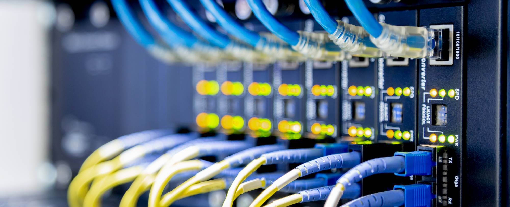

# Network Addressing and Basic Troubleshooting - 7 Modules

<figure><figcaption></figcaption></figure>

## Module 1: Physical Layer

<figure><figcaption></figcaption></figure>

TIL Manchester encoding is a thing:&#x20;

<figure><figcaption></figcaption></figure>

The transition occurs at the middle of each bit period. ^^

<figure><figcaption></figcaption></figure>

<figure><figcaption></figcaption></figure>

<figure><figcaption></figcaption></figure>

<figure><figcaption></figcaption></figure>

<figure><figcaption></figcaption></figure>

<figure><figcaption></figcaption></figure>

<figure><figcaption></figcaption></figure>

The numbers in the figure identify some key features of shielded twisted pair cable(STP):

1. Outer jacket
2. Braided or foil shield
3. Foil shields
4. Twisted pairs

<figure><figcaption></figcaption></figure>

* The numbers in the figure identify some key features of coaxial cable:
  1. Outer jacket
  2. Braided copper shielding
  3. Plastic insulation
  4. Copper conductor

The coaxial cable design is used in the following situations:

* **Wireless installations** - Coaxial cables attach antennas to wireless devices. The coaxial cable carries radio frequency (RF) energy between the antennas and the radio equipment.
* **Cable internet installations** - Cable service providers provide internet connectivity to their customers by replacing portions of the coaxial cable and supporting amplification elements with fiber-optic cable. However, the wiring inside the customer's premises is still coax cable.

<figure><figcaption>
<a href="https://www.netacad.com/content/nabt/1.0/courses/content/m1/en-US/assets/Copper-cabling-page3.jpg">https://www.netacad.com/content/nabt/1.0/courses/content/m1/en-US/assets/Copper-cabling-page3.jpg</a>
</figcaption></figure>

### UTP

<figure><figcaption>
See how different coloured cable pairs are twisted differently.
</figcaption></figure>

**Cancellation -** Designers now pair wires in a circuit. When two wires in an electrical circuit are placed close together, their magnetic fields are the exact opposite of each other. Therefore, the two magnetic fields cancel each other and also cancel out any outside EMI and RFI signals.

**Varying the number of twists per wire pair -** To further enhance the cancellation effect of paired circuit wires, designers vary the number of twists of each wire pair in a cable. UTP cable must follow precise specifications governing how many twists or braids are permitted per meter (3.28 feet) of cable. Notice in the figure that the orange/orange white pair is twisted less than the blue/blue white pair. Each colored pair is twisted a different number of times.
