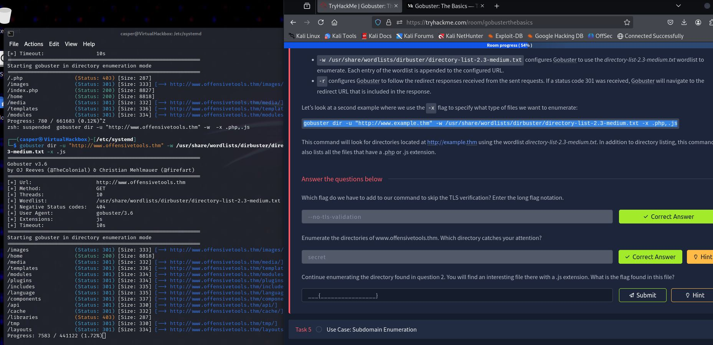

# Gobuster

29/03/25 - Worked with Gobuster today. Hardest bit was gettng dnsmasq thingy to work correctly :angry:

<figure><figcaption></figcaption></figure>

downloaded this [https://gitlab.com/kalilinux/packages/seclists/-/tree/f8146198d2359eaaabd0bd18b4afa880965449e8](https://gitlab.com/kalilinux/packages/seclists/-/tree/f8146198d2359eaaabd0bd18b4afa880965449e8) to my kali machine. Only needed one 3.30KiB file but ended up downloading the whole 1GB directory. I can't even tell what half the stuff is for.

Extensions syntax

`-x .html,.txt,.js,.php,.css,.pdf`

/usr/share/wordlists/dirb/extensions\_common.txt

Examples of file extensions and their formats:

* **Text and word processing:** `.txt`, `.doc`, `.docx`, `.rtf`, `.odt`, `.pages`
* **Spreadsheets:** `.csv`, `.xls`, `.xlsx`, `.ods`, `.numbers`
* **Web-related:** `.html`, `.html`, `.css`, `.asp`, `.aspx`, `.php`, `.jsp`
* **Image:** `.jpg`, `.png`, `.gif`, `.bmp`, `.tiff`
* **Audio and video:** `.mp3`, `.mp4`, `.wav`, `.avi`, `.flv`
* **Executable:** `.exe`, `.dll`, `.jar`&#x20;

## VHOST

`sudo gobuster vhost -u "http://webenum.thm//" -w /usr/share/wordlists/dirb/common.txt -t 100 --append-domain | grep 200`

`sudo gobuster dir -u "http://products.webenum.thm/" -w /usr/share/wordlists/dirb/common.txt -t 100 -x .txt`

