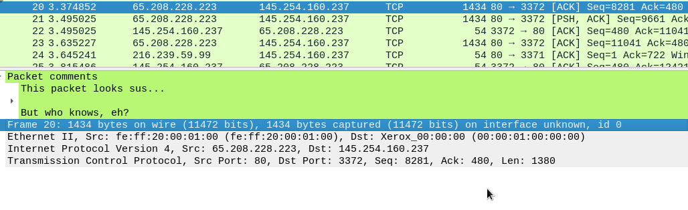
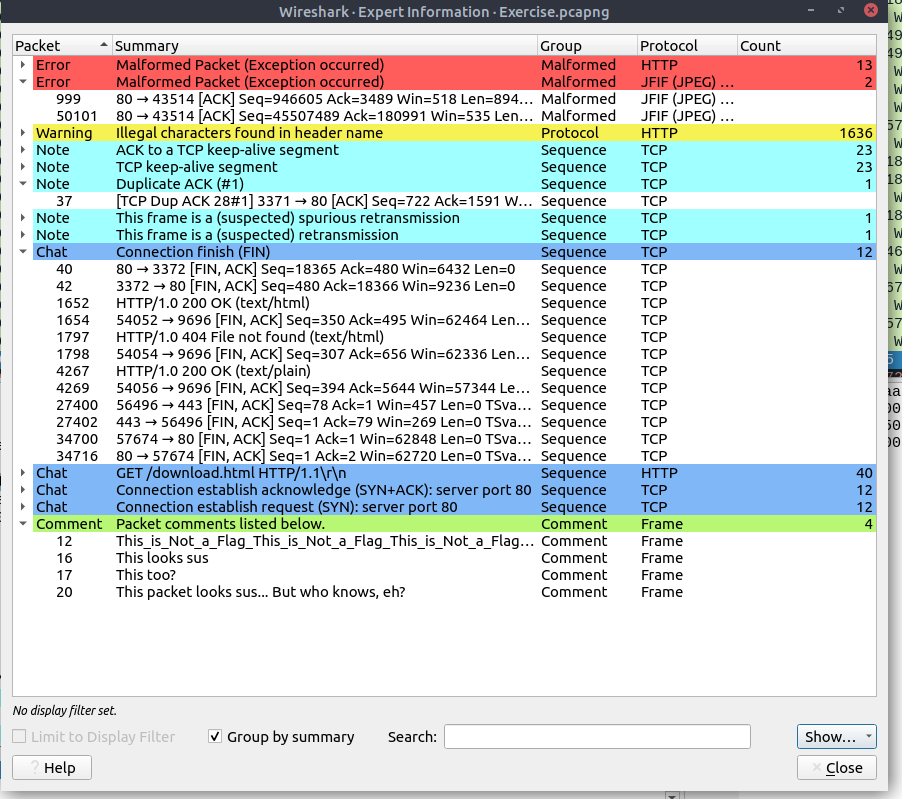

# Wireshark: The basics

[https://tryhackme.com/r/room/wiresharkthebasics](https://tryhackme.com/r/room/wiresharkthebasics)


[https://www.wireshark.org/docs/](https://www.wireshark.org/docs/)


Packet capture (PCAP) is a networking practice involving the interception of data packets travelling over a network. Once the packets are captured, they can be stored by IT teams for further analysis. The inspection of these packets allows IT teams to identify issues and solve network problems affecting daily operations.

Wireshark is one of the most potent traffic analyser tools available in the wild. There are multiple purposes for its use:

* Detecting and troubleshooting network problems, such as network load failure points and congestion.
* Detecting security anomalies, such as rogue hosts, abnormal port usage, and suspicious traffic.
* Investigating and learning protocol details, such as response codes and payload data.&#x20;

Wireshark is not an Intusion Detection System (IDS) Wireshark discovers and investigate packets in depth. You are not able to modify packets

| Toolbar                       | 
The main toolbar contains multiple menus and shortcuts for packet sniffing and processing, including filtering, sorting, summarising, exporting and merging.  
                                                             |
| ----------------------------- | ------------------------------------------------------------------------------------------------------------------------------------------------------------------------------------------------------------------------------------ |
| Display Filter Bar            | The main query and filtering section.                                                                                                                                                                                                |
| Recent Files                  | List of the recently investigated files. You can recall listed files with a double-click.                                                                                                                                            |
| Capture Filter and Interfaces | Capture filters and available sniffing points (network interfaces).  The network interface is the connection point between a computer and a network. The software connection (e.g., lo, eth0 and ens33) enables networking hardware. |
| Status Bar                    | Tool status, profile and numeric packet information.                                                                                                                                                                                 |

<figure><figcaption></figcaption></figure>

| 
Packet List Pane 
    | 
Summary of each packet (source and destination addresses, protocol, and packet info). You can click on the list to choose a packet for further investigation. Once you select a packet, the details will appear in the other panels. 
 |
| ------------------------------ | ----------------------------------------------------------------------------------------------------------------------------------------------------------------------------------------------------------------------------------------------- |
| 
Packet Details Pane 
 | 
Detailed protocol breakdown of the selected packet. 
                                                                                                                                                                                  |
| 
Packet Bytes Pane 
   | Hex and decoded ASCII representation of the selected packet. It highlights the packet field depending on the clicked section in the details pane.                                                                                               |

<figure><figcaption></figcaption></figure>

#### The various colours of packets:

<figure><figcaption></figcaption></figure>

#### Traffic sniffing

<figure><figcaption></figcaption></figure>

#### You can merge 2 PCAP files&#x20;

**"File --> Merge"** menu path to merge a pcap with the processed one.Note that you need to save the "merged" pcap file before working on it.

## Packet Dissection

more details on dissection on [https://github.com/boundary/wireshark/blob/master/doc/README.dissector](https://github.com/boundary/wireshark/blob/master/doc/README.dissector)

**Ctrl + G**  is Go to Packet

**Ctrl + F** to Find

**Ctrl + M** to mark a packet

**Ctrl + Alt + C** to make a comment

<figure><figcaption>
Making a comment
</figcaption></figure>

**Use File > Export Specified Packets** for exporting 1 or more packets that look sus and need more in depth inspection

**Use File > Export Objects** (DICOM, HTTP, IMF, SMB and TFTP only)

**View > Time Display Format > UTC Date and Time of Day.**.. for a better view

<figure><figcaption>
Difference between Time Display Formats
</figcaption></figure>

Expert info can be accesed via Analyse > **Expert Information** to see anomalies and problems. There is always a chance of having false positives/negatives.

<figure><figcaption>
Expert Info
</figcaption></figure>

## Packet Filtering

there is a golden rule for analysts who don't want to write queries for basic tasks: **"If you can click on it, you can filter and copy it"**.

### &#x20;**Apply as Filter**

click on the field you want to filter and use the "right-click menu" or "**Analyse --> Apply as Filter"**

### Conversation Filter

When you use the "**Apply as a Filter**" option, you will filter only a single entity of the packet. This option is a good way of investigating a particular value in packets. However, suppose you want to investigate a specific packet number and all linked packets by focusing on IP addresses and port numbers. In that case, the "Conversation Filter" option helps you view only the related packets and hide the rest of the packets easily. You can use the"right-click menu" or "**Analyse --> Conversation Filter**" menu to filter conversations.

### Colourise conversation

similiar to Conversation filter but this only highlights the linked packets and doesn't dissaper&#x20;

**Shift + Space** to reset the colours back to normal

### Prepare as Filter

Similar to **Apply as Filter** however this doesn't activate immediately but waits for execution command (enter) or another chosen filtering option by using the **".. and/or.."** from the "right-click menu".

### Apply as column

You can use the "right-click menu" or "Analyse **-->** Apply as Column" To add a column such as Port, source, Time To Live etc..

### Follow Stream

Wireshark displays everything in packet portion size. However, it is possible to reconstruct the streams and view the raw traffic as it is presented at the application level. Following the protocol, streams help analysts recreate the application-level data and understand the event of interest. It is also possible to view the unencrypted protocol data like usernames, passwords and other transferred data.

You can use the "right-click menu" or  **"Analyse --> Follow TCP/UDP/HTTP Stream"** menu to follow traffic streams. Packets originating from the server are highlighted with blue, and those originating from the client are highlighted with red

