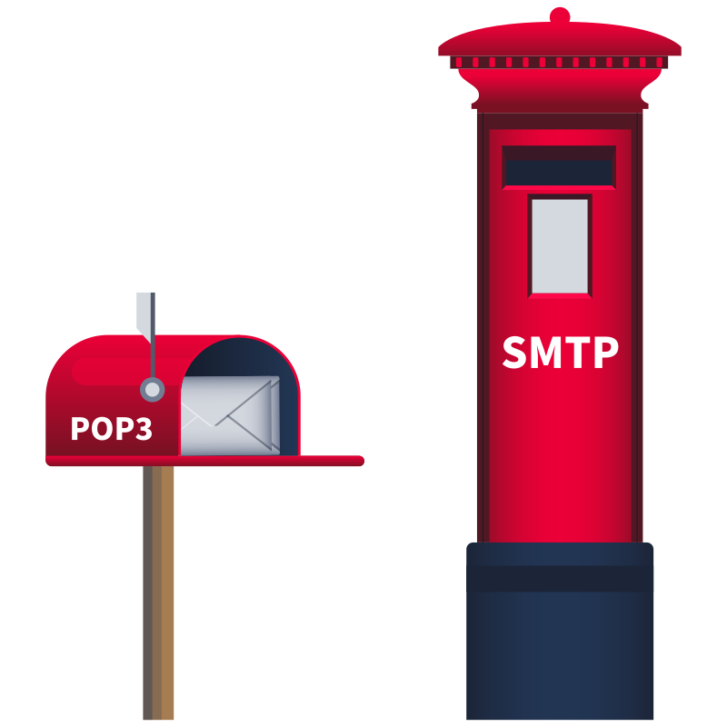

# Receiving email: POP3 (Post Office Protocol v3)

<figure><figcaption></figcaption></figure>

Some common POP3 commands are:

* `USER <username>` identifies the user
* `PASS <password>` provides the user’s password
* `STAT` requests the number of messages and total size
* `LIST` lists all messages and their sizes
* `RETR <message_number>` retrieves the specified message
* `DELE <message_number>` marks a message for deletion
* `QUIT` ends the POP3 session applying changes, such as deletions

If anyone was to capture the network packets they'd be able to get the username and password as it isn't encrypted&#x20;
