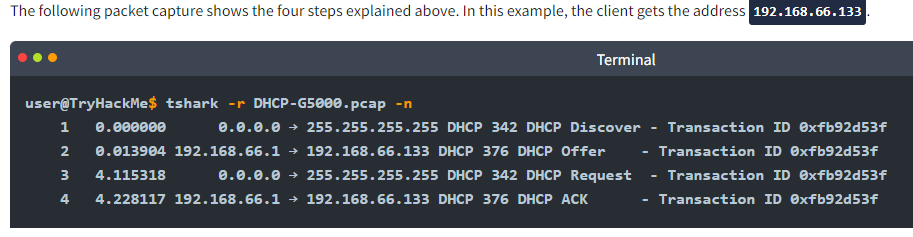

# DHCP (Dynamic Host Configuration Protocol)

The Dynamic Host Configuration Protocol (DHCP) is a network management protocol used on Internet Protocol (IP) networks for automatically assigning IP addresses and other communication parameters to devices connected to the network using a client–server architecture.

Whenever we want to access a network, at the very least, we need to configure the following:

* IP address along with subnet mask
* Router (or gateway)
* DNS server

DHCP follows four steps: Discover, Offer, Request, and Acknowledge (DORA):

<figure><figcaption>
DHCP follows four steps: Discover, Offer, Request, and Acknowledge (DORA):
</figcaption></figure>

1. **DHCP Discover**: The client broadcasts a DHCPDISCOVER message seeking the local DHCP server if one exists.
2. **DHCP Offer**: The server responds with a DHCPOFFER message with an IP address available for the client to accept.
3. **DHCP Request**: The client responds with a DHCPREQUEST message to indicate that it has accepted the offered IP.
4. **DHCP Acknowledge**: The server responds with a DHCPACK message to confirm that the offered IP address is now assigned to this client.

<figure><figcaption></figcaption></figure>

DHCP is an application-level protocol that relies on UDP; the server listens on UDP port 67, and the client sends from UDP port 68. Your smartphone and laptop are configured to use DHCP by default.

<figure><figcaption>
DHCP Packet exchange
</figcaption></figure>

At the end of the DHCP process, our device would have received all the configuration needed to access the network or even the Internet. In particular, we expect that the DHCP server has provided us with the following:

* The leased IP address to access network resources
* The gateway to route our packets outside the local network
* A DNS server to resolve domain names&#x20;

## Static vs dynamic IP

Every network attached device (computer, printer, switch, etc) needs to have an address on the network, much like your home has an address.

If you want to mail a letter to your cousin in another state, you write their address on the envelope, and the postal system knows how to deliver the letter based on the information provided. Without this address, the post office has no idea where to deliver the letter. A home address is a static IP address. It doesn't change. It's something that was given to that house when it was built and meant to be permanent and non changing forever. This is like a static IP address. (For the purposes of this explanation, I'm saying static IP addresses can't change, but they really can and it's a manual process.)

Now, what if you weren't given a permanent address forever. How would you mail letters without an address? You can't. This is where DHCP comes in. DHCP is technically a protocol, but for this explanation that doesn't matter. It exists/is setup as a service on a server or as built in functionality of a router.

DHCP is dynamic, it can change, and does change. Computers and other network devices constantly connect and disconnect. You take your laptop from work, and you bring it home. This is why your laptop can't have a static address (like your home). If everything was static, we would run out of IP Addresses because every time a device connects to a network, that would be it's IP address forever. Also, every network has the potential to have a different subnet. Your work subnet may be 192.168.1.x, and your home may be 192.168.0.x -- we need your laptop IP address to be able to change based on where it is, and the subnet used at that location. IP addresses are finite. So we need a way to release this address after some time as well. If the device is still connected, it will get that IP Address again, if it's not connected, the address will be released so another computer can take it.

The server or router not only issues these addresses, but keeps track of all the IP addresses it gives to all the connected devices. It maintains that time frame where it will release the IP address, and if the computer still needs it, it will give it again.
