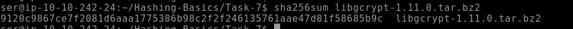

# Hashing for Integrity Checking

<figure><figcaption>
using sha256sum on a file to check its hash
</figcaption></figure>

This can be used when downloading a file to confirm you've downloaded the correct file.

It can be used to check for duplicates

it can be used to check if any changes been made to the file. Even if a single bit changes, it changes the hash completely.

## HMAC

HMAC (Keyed-Hash Message Authentication Code) is a way to make sure a message hasn't been tampered with and comes from someone who knows a secret key.

Here’s how it works, step by step:

1. **Secret Key**: You and the other person agree on a secret key. Only the two of you know it.
2. **Message**: You want to send a message (e.g., "Hello, world!").
3. **Hash Function**: HMAC uses a special mathematical tool called a hash function (like SHA-256). This tool takes any input (e.g., your message) and turns it into a fixed-size string of numbers and letters.
4. **Mix the Key and Message**: HMAC combines the secret key and the message in a specific way, then runs them through the hash function.
5. **Output a "Tag"**: The result of the hash function is a "tag" (a string of numbers/letters) that is unique to your message and key. This tag is sent along with the message.
6. **Verification**: When the other person gets the message and tag, they use the same key and hash function to recreate the tag. If the tag matches, they know the message is from you and hasn’t been changed. If it doesn’t match, they know something went wrong (either the message was tampered with or the key is wrong).

#### Why is this secure?

* The secret key ensures that only someone who knows the key can create a valid tag.
* The hash function ensures that even a tiny change in the message or key produces a completely different tag, making tampering obvious.

Think of HMAC like a lock: the secret key is the key to the lock, and the tag is proof that the message is secure and hasn’t been messed with.

<figure><figcaption></figcaption></figure>

Technically speaking, the HMAC function is calculated using the following expression:

$$HMAC(K,M) = H((K⊕opad)||H((K⊕ipad)||M))$$

Note that M and K represent the message and the key, respectively.
