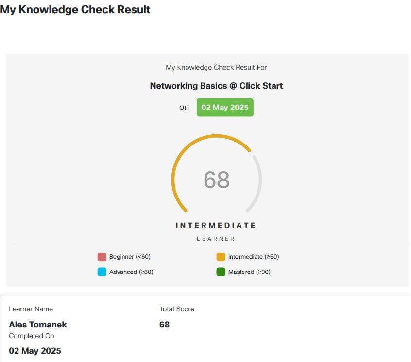
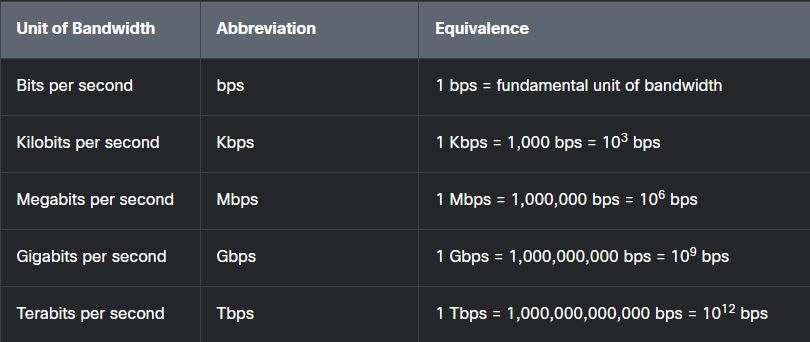
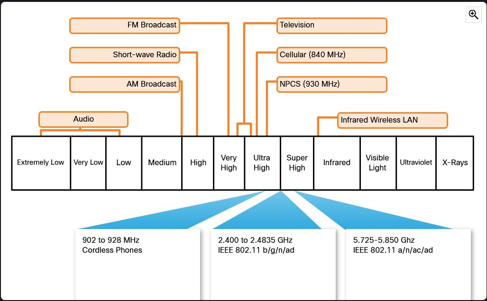
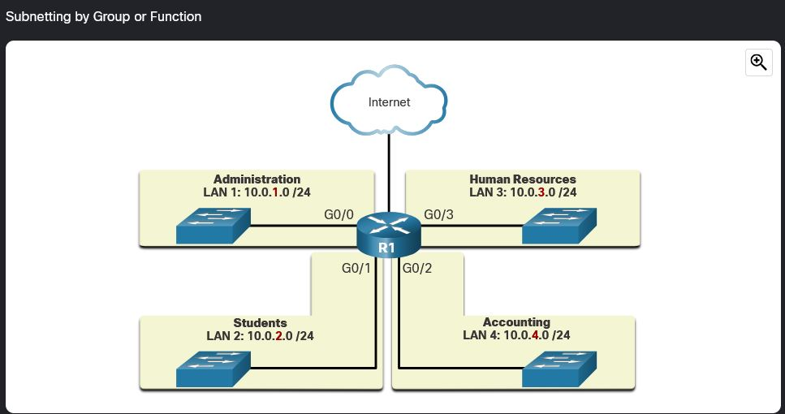
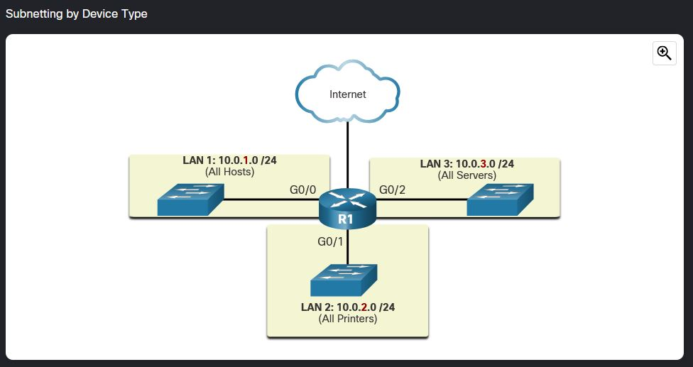
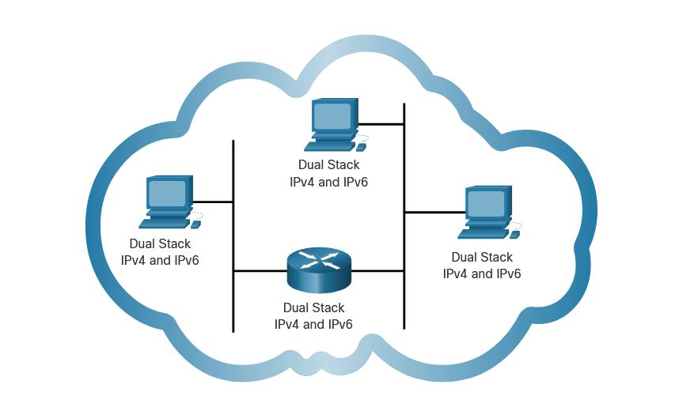
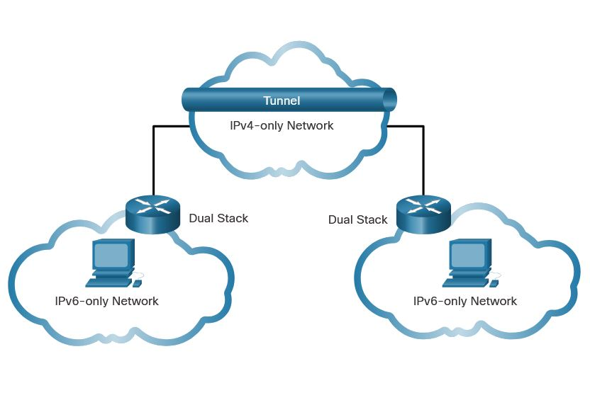
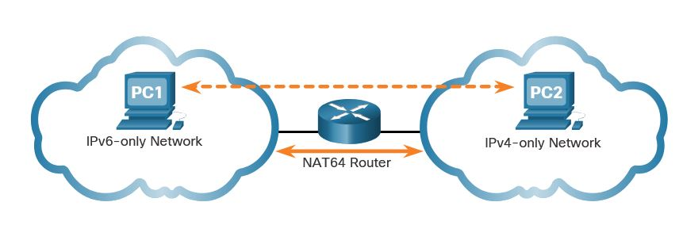
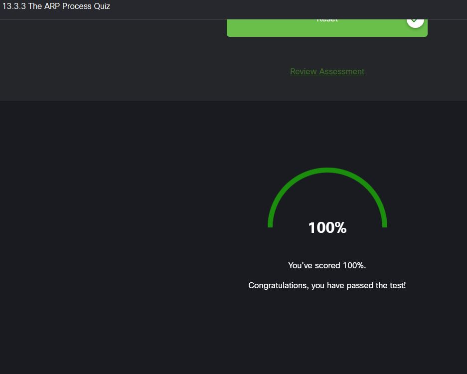

# Networking Basics - 17 Modules

Upon completion of the Networking Basics course, students will be able to perform the following tasks:

* Explain important concepts in network communication.
* Explain network types, components, and connections.
* Configure mobile devices for wireless access.
* Configure an integrated wireless router and wireless client to connect securely to the internet.
* Explain the importance of standards and protocols in network communications.
* Describe common network media.
* Explain how communication occurs on Ethernet networks.
* Explain the features of an IP address.
* Explain how IPv4 addresses are used in network communication and segmentation.
* Explain features of IPv6 addressing.
* Configure a DHCP server.
* Explain how routers connect networks together.
* Explain how ARP enables communication on a network.
* Create a fully connected LAN.
* Explain how clients access internet services.
* Explain the function of common application layer services.
* Use various tools to test and troubleshoot network connectivity.

## Knowledge on the subject at the start of the course:

<figure><figcaption></figcaption></figure>



<figure><figcaption></figcaption></figure>

<figure><figcaption></figcaption></figure>

lol ^ . 2 months of studuying I got 3 points less than before on the checkpoint exam.

## Notes I keep here I mostly things that were new to me OR I just got it wrong in the quiz

## Module 1: Communication in a Connected World

Networks installed in small offices, or homes and home offices, are referred to as small office/home office (SOHO) networks

### Connected devices (other than the obvious ones):

**Radio frequency identification (RFIDs)** tags can be placed in or on objects to track them or monitor sensors for many conditions.

**Medical Devices**

Medical devices such as pacemakers, insulin pumps, and hospital monitors provide users or medical professionals with direct feedback or alerts when vital signs are at specific levels.

### Module 1.2.2&#x20;

TIL: The term bit is an abbreviation of “binary digit”

### 1.3.1 Bandwidth

Bandwidth is the theoretical number of bits that can be sent across the media in a second. Measured in bits per second. Kbps, Mbps, Gbps...

<figure><figcaption></figcaption></figure>

### 1.3.2 - Throughput



Like bandwidth, throughput is the measure of the transfer of bits across the media over a given period of time. However, due to a number of factors, throughput does not usually match the specified bandwidth. Many factors influence throughput including:

* The amount of data being sent and received over the connection
* The types of data being transmitted
* The latency created by the number of network devices encountered between source and destination

## Module 2: Network Components, Types, and Connections

### 2.1.3 Peer-to-Peer Networks (P2P)

P2P is network where computers run both client and server software at the same time

[![What is P2P VPN? \[The Ultimate Guide\]](https://encrypted-tbn0.gstatic.com/images?q=tbn:ANd9GcSk0rbQsL9zYKOI-EqGScuC1oC-OSe_UzEY0Q\&s)](https://techjury.net/blog/what-is-p2p-vpn/)

The advantages of peer-to-peer networking:

* Easy to set up
* Less complex
* Lower cost because network devices and dedicated servers may not be required
* Can be used for simple tasks such as transferring files and sharing printers

The disadvantages of peer-to-peer networking:

* No centralized administration
* Not as secure
* Not scalable
* All devices may act as both clients and servers which can slow their performance

## Module 3: Wireless and Mobile Networks

**Question 2:** Which wireless technology uses a device-pairing process to communicate and operates over short distances of 100 meters?

**Answer:** Wireless networks can be broadly classified as follows:

* Wireless wide-area network (WWAN) – It operates in the range of miles.
* Wi-Fi – It operates up to distances of 0.18 miles and provides network access to home and corporate users and can include data, voice and video traffic.
* **Bluetooth – It uses a device-pairing process to communicate over distances of up to 0.05 miles.**
* GPS - It uses satellites to transmit signals that cover the globe.\


**Question 6:** Which technology will allow a mobile device to share an internet connection with other devices via tethering? -&#x20;

**Answer:** Tethering is commonly done over Bluetooth or a USB cable. A mobile hotspot is another form of internet sharing and is provided over Wi-Fi.


## Module 4: Network Technologies in the Home

Bluetooth is a technology that makes use of the 2.4 GHz band

<figure><figcaption><p><a href="https://www.netacad.com">https://www.netacad.com</a></p></figcaption></figure>

**Q:** Certain areas of the electromagnetic spectrum can be used without a permit.

**A:** TRUE

## Module 5: Communications Principles

**Q:** Bianka, a Polish traveler in Hanoi, Vietnam, stops and asks Nguyệt for directions to the Ngoc Son Temple. They verbally communicate and determine that they both speak English. After receiving directions in English to the temple, Bianka repeats them to Nguyệt. Nguyệt says, "Yes, that is correct." Select the order of the communications protocols used in this scenario?

**A: Method, language, confirmation**

**Q:** Rory is studying the fields inside an Ethernet frame for an upcoming test and notices that the destination Media Access Control (MAC) address is listed first before the source MAC address. Which of the following protocol characteristics is Rory investigating?

**A: Encapsulation**

<figure><figcaption><p>Cisco Networking Academy</p></figcaption></figure>

<table><thead><tr><th width="182">Protocol Characteristic</th><th>Description</th></tr></thead><tbody><tr><td>Message Format</td><td>Format or Structure</td></tr><tr><td>Message size</td><td>Very strict and specific rules regarding size</td></tr><tr><td>Timing</td><td>Speed at which the bits are transmitted. Also when data can be sent and the total amount</td></tr><tr><td>Encoding</td><td>Message gets converted into bits, then into pattern of sounds, light waves or electrical impulses depending on how its being transmitted</td></tr><tr><td>Encapsulation</td><td>Matryoshka style -  Every layer add a header with information. See pictures bellow</td></tr><tr><td>Message pattern</td><td>Some messages require an ACKnowledgment </td></tr></tbody></table>


<figure><figcaption><p><a href="https://www.computernetworkingnotes.com/ccna-study-guide/data-encapsulation-and-de-encapsulation-explained.html">https://www.computernetworkingnotes.com/ccna-study-guide/data-encapsulation-and-de-encapsulation-explained.html</a></p></figcaption></figure>

<figure><figcaption><p><a href="https://www.computernetworkingnotes.com/ccna-study-guide/data-encapsulation-and-de-encapsulation-explained.html">https://www.computernetworkingnotes.com/ccna-study-guide/data-encapsulation-and-de-encapsulation-explained.html</a></p></figcaption></figure>


## Module 9  IPv4 and Network segmentation

### Unicast

1 source IP -> 1 destination IP

### Broadcast

1 source IP ->  all on the network (but source) will receive the packet

A broadcast packet has a destination IP address with all ones (1s) in the host portion, or 32 one (1) bits.

For example, a host on the 172.16.4.0/24 network sends a packet to 172.16.4.255. A limited broadcast is sent to 255.255.255.255.

### Multicast

1 source IP -> to selected IP destinations&#x20;

IPv4 has reserved the 224.0.0.0 to 239.255.255.255 addresses as a multicast range.

Routing protocols such as OSPF use multicast transmissions.


A broadcast packet has a destination IP address with all ones (1s) in the host portion, or 32 one (1) bits.&#x20;

Destination 255.255.255.255

**Note:** IPv4 uses broadcast packets. However, there are no broadcast packets with IPv6.

### Private IP ranges

Private networks can use several IP address ranges assigned by the Internet Assigned Numbers Authority (IANA). These reserved IP address ranges are used by millions of private networks around the world. Private networks should utilize the following address ranges:

* Class A- 10.0.0.0 to 10.255.255.255
* Class B- 172.16.0.0 to 172.31.255.255
* Class C- 192.168.0.0 to 192.168.255.25

### Public IP ranges

All addresses outside private IP address ranges are considered public. But all the IP addresses that fall into one of the following predefined public IP address ranges are definitely public IP addresses. Public IP addresses are significantly more common than private IP addresses, and the public IP address ranges are:

* 1.0.0.0 – 9.255.255.255
* 11.0.0.0 – 126.255.255.255
* 129.0.0.0 – 169.253.255.255
* 169.255.0.0 – 172.15.255.255
* 172.32.0.0 – 191.0.1.255
* 192.0.3.0 – 192.88.98.255
* 192.88.100.0 – 192.167.255.255
* 192.169.0.0 – 198.17.255.255
* 198.20.0.0 – 223.255.255.255

### Subnetting

Subnetting reduces overall network traffic and improves network performance. It also enables an administrator to implement security policies such as which subnets are allowed or not allowed to communicate together. Another reason is that it reduces the number of devices affected by abnormal broadcast traffic due to misconfigurations, hardware/software problems, or malicious intent.

<figure><figcaption><p>Subnetting by Location</p></figcaption></figure>

<figure><figcaption><p>Subnetting by Group of Function</p></figcaption></figure>

<figure><figcaption><p>Subnetting by Device Type</p></figcaption></figure>

## Module 10 IPv6

### Dual stack

Dual stack allows both ipv4 and ipv6 to coexist on the same network

<figure><figcaption><p>Dual Stack</p></figcaption></figure>

### Tunnelling

Tunnelling is a method of transporting an IPv6 packets over IPv4 network. The IPv6 packet is encapsulated inside the IPv4 packet

<figure><figcaption><p>Tunneling</p></figcaption></figure>

### Translation

Network Address Translation 64 (NAT64) allows IPv4 or IPv6 packets to be translated from one "language" to another

&#x20;IPv4 -> IPv6.&#x20;

IPv6 -> IPv4


<figure><figcaption><p>Translation</p></figcaption></figure>

Note: Tunnelling and translation are for transitioning to native IPv6 and should only be used where needed. The goal should be native IPv6 communications from source to destination.


## Module 11 - DHCP

<figure><figcaption><p><a href="https://www.pynetlabs.com/what-is-dhcp/">https://www.pynetlabs.com/what-is-dhcp/</a></p></figcaption></figure>

#### **DHCPDISCOVER (Broadcast)**

* The host (client) sends a **DHCPDISCOVER** message to **255.255.255.255** to find available DHCP servers.
* **All DHCP servers** on the local network receive this broadcast.

***

#### **2. DHCPOFFER (Unicast or Broadcast)**

* **Each DHCP server** that receives the DISCOVER responds with a **DHCPOFFER**, which includes an available IP address and configuration info.
* These offers are either **broadcast back** or **unicast to the client**, depending on the situation.

***

#### **3. DHCPREQUEST (Broadcast)**

* The client selects **one** of the offers (typically the first it receives) and sends a **DHCPREQUEST** message.
* This request is **broadcast** so that all DHCP servers know which offer the client accepted.

***

#### **4. DHCPACK (Unicast or Broadcast)**

* The DHCP server whose offer was accepted replies with a **DHCPACK**, finalizing the lease.
* Other DHCP servers, seeing the DHCPREQUEST, **withdraw** their offers and do not respond.

***

#### Summary of Message Flow:

<table><thead><tr><th width="90">Step</th><th>Message</th><th>Direction</th><th>Purpose</th></tr></thead><tbody><tr><td>1</td><td>DHCPDISCOVER</td><td>Client → Broadcast</td><td>Find DHCP servers</td></tr><tr><td>2</td><td>DHCPOFFER</td><td>Servers → Client</td><td>Offer IP and settings</td></tr><tr><td>3</td><td>DHCPREQUEST</td><td>Client → Broadcast</td><td>Accept one offer</td></tr><tr><td>4</td><td>DHCPACK</td><td>Chosen Server → Client</td><td>Confirm lease</td></tr></tbody></table>


## Module 12: Gateways to Other Networks

From this point onwards, I'll try to make note of at least 1 thing from each module.

<figure><figcaption></figcaption></figure>

NAT (Network Address Translation) saved the world&#x20;

<figure><figcaption></figcaption></figure>

Q1: A computer has to send a packet to a destination host in the same LAN. How will the packet be sent?

A1: The packet will be sent directly to the destination host.

&#x20;If the destination host is in the same LAN as the source host, there is no need for a default gateway. A default gateway is needed if a packet needs to be sent outside the LAN.

Q5: If the default gateway is configured incorrectly on a host, what is the impact on communications?

In data communication, the default gateway device is involved only when a host needs to communicate with other hosts on another network. The default gateway address identifies a network device that a host device uses to communicate with devices on other networks. The default gateway device is not used when a host communicates with other hosts on the same network.

## Module 13: The ARP Process (Address Resolution Protocol)

IP Address is a logical address

Q:What two protocols are used to determine the MAC address of a known destination device IP address (IPv4 and IPv6)?

A: Address Resolution Protocol (ARP) is used to determine the device MAC address of a known destination device IPv4 address. Neighbor Discovery Protocol(NDP) is used to determine the MAC address of a known destination device IPv6 address.

ARP table is stored in RAM

The destination MAC address for an Ethernet broadcast is FFFF.FFFF.FFFF. The broadcast MAC address is a 48-bit address made up of all ones . Each F in the hexadecimal notation represents four ones in the binary address.

When an Ethernet switch receives a frame that is broadcast, it will forward the frame out all ports except the incoming port.

An ARP request is a broadcast, so all devices on the network will receive it.

A host will send an ARP reply if the IP address in the ARP request matches its own IP address.

An ARP reply will include the IP and MAC address of the host that sent the reply

IPv6 uses a similar method known as Neighbor Discovery.

In order for PC1 to communicate with PC2, PC1 needs to know MAC address of PC2. This where ARP comes in.&#x20;

<figure><figcaption><p><a href="https://www.techtarget.com/rms/onlineimages/whatis-arp.png">https://www.techtarget.com/rms/onlineimages/whatis-arp.png</a></p></figcaption></figure>

<figure><figcaption><p><a href="https://walid-mahmoud.medium.com/osi-model-layer-3-address-resolution-protocol-arp-2dc4e8208743">https://walid-mahmoud.medium.com/osi-model-layer-3-address-resolution-protocol-arp-2dc4e8208743</a></p></figcaption></figure>

<figure><figcaption><p>23/06/25</p></figcaption></figure>

## Module 14: Routing Between Networks

Devices that are beyond the local network segment are known as remote hosts

Routing is the process of identifying the best path to a destination.

You would divide a network into multiple smaller networks to maintain smaller broadcast domains and increase network security.

Routers divide a network into smaller networks.

The important thing to remember is that all the local networks within a LAN are under one administrative control

There are many ways to divide networks based on different criteria:

* **Broadcast containment** - Routers in the distribution layer can limit broadcasts to the local network where they need to be heard.
* **Security requirements** - Routers in the distribution layer can separate and protect certain groups of computers where confidential information resides.
* **Physical locations** - Routers in the distribution layer can be used to interconnect local networks at various locations of an organization that are geographically separated.
* **Logical grouping** - Routers in the distribution layer can be used to logically group users, such as departments within a company, who have common needs or for access to resources.

<figure><figcaption><p>Took 2 tries to get 75%</p></figcaption></figure>

## Checkpoint Exam

first try:&#x20;

<figure><figcaption><p>Routing between networks 14.3% ?! :(</p></figcaption></figure>

<figure><figcaption><p>Second try was much better</p></figcaption></figure>

## Module 15: TCP and UDP

<figure><figcaption></figcaption></figure>

<figure><figcaption></figcaption></figure>

Well known ports: 1 to 1023 - For all the services you've definitely heard of&#x20;

Registered Ports: 1024 to 49151 - specific applications such as IM applications&#x20;

Private Ports: 49152 to 65535 - usualy source ports. Used by any application

<figure><figcaption><p>Well-known ports and their associated applications</p></figcaption></figure>

### Socket Pairs

TIL source port of a service is dynamically generated by the host

<figure><figcaption></figcaption></figure>

Together, these two sockets combine to form a socket pair: 192.168.1.5:1099, 192.168.1.7:80

Sockets enable multiple processes, running on a client, to distinguish themselves from each other, and multiple connections to a server process to be distinguished from each other.

### Netstat command will show all active connections to a localhost

By default, the netstat command will attempt to resolve IP addresses to domain names and port numbers to well-known applications. The -n option can be used to display IP addresses and port numbers in their numerical form.


<figure><figcaption><p><a href="https://resource.fs.com/mall/generalImg/TItmbATfnobgYOxyA8mcIznSnZd.png">https://resource.fs.com/mall/generalImg/TItmbATfnobgYOxyA8mcIznSnZd.png</a></p></figcaption></figure>

### ChatGpt's ELI5 breakdown of Segments, Packets, Frames, Fragments and Datagrams

Sure! Here's an **ELI5** (Explain Like I'm 5) breakdown of these terms using a fun **mail delivery analogy**. Imagine you're sending a toy robot to your friend across the country:

***

#### 🧩 **Segment** – The Box of Robot Parts

You take your toy robot apart and pack its pieces into boxes. Each box might say “Head,” “Arms,” “Legs.” These boxes are **segments** — they carry part of the robot and are labeled so your friend knows how to put them back together.

➡️ **In computers:** A **segment** comes from the **Transport Layer (like TCP)**. It’s part of the original message your computer wants to send.

***

#### ✉️ **Packet** – The Addressed Parcel

Now, you write your friend's **name and street address** on the boxes so the postal service knows where to send them. This makes each box a **packet**.

➡️ **In computers:** A **packet** is a segment **with an IP address** — it comes from the **Network Layer**. It's like, "Hey, deliver this to 192.168.1.12!"

***

#### 📦 **Frame** – The Mail Truck Load

The mail truck needs to deliver your box to the right house on the street. It doesn't care about the city or post code, just the local delivery. So the box goes into a **mail truck**, which reads **local delivery info**.

➡️ **In computers:** A **frame** is a packet **with a MAC address** added — the **Data Link Layer** handles it. Think: "Take this to the right device on this street (local network)."

***

#### 💣 **Fragment** – Cutting a Big Box into Smaller Boxes

What if your box is **too big** for the truck? You cut it into smaller boxes labeled “Part 1 of 3,” “Part 2 of 3,” etc. That’s **fragmentation**.

➡️ **In computers:** A **fragment** is a **piece of a packet** that was too big and had to be broken up for travel across a network.

***

#### 📮 **Datagram** – A One-Way Postcard

This is like sending a **postcard**. You write a quick message, address it, and send it off. You don’t know if it got there, but it’s fast and simple.

➡️ **In computers:** A **datagram** is a **packet sent using UDP** (no delivery confirmation). It’s like, “Hey! Hope you get this!”

***

#### TL;DR:

| Term     | Analogy            | Layer           | Key Idea                    |
| -------- | ------------------ | --------------- | --------------------------- |
| Segment  | Box of robot parts | Transport       | Part of original message    |
| Packet   | Addressed parcel   | Network         | Segment + IP address        |
| Frame    | Mail truck load    | Data Link       | Packet + MAC address        |
| Fragment | Cut-up big box     | Network         | A piece of a large packet   |
| Datagram | One-way postcard   | Transport (UDP) | Fast, no delivery guarantee |

<figure><figcaption><p>15.3.3 TCP and UDP Quiz on 02/07/2025</p></figcaption></figure>

## Module 16: Application Layer Services

<figure><figcaption></figcaption></figure>


<figure><figcaption></figcaption></figure>

<figure><figcaption></figcaption></figure>

<figure><figcaption></figcaption></figure>

<figure><figcaption></figcaption></figure>

<figure><figcaption></figcaption></figure>

11/07/25

## Module 17: Network Testing Abilities&#x20;


```bash
ipconfig
ipconfig /all    # displays additional information including the MAC address, IP addresses of the default gateway, and the DNS servers. It also indicates if DHCP is enabled, the DHCP server address, and lease information.
ipconfig /release # will release the current DHCP bindings.
ipconfig /renew  # will request fresh configuration information from the DHCP server
```


<figure><figcaption></figcaption></figure>

<figure><figcaption></figcaption></figure>

<figure><figcaption></figcaption></figure>

<figure><figcaption></figcaption></figure>

<figure><figcaption></figcaption></figure>

lol ^ . 2 months of studuying I got 3 points less than before on the checkpoint exam.
