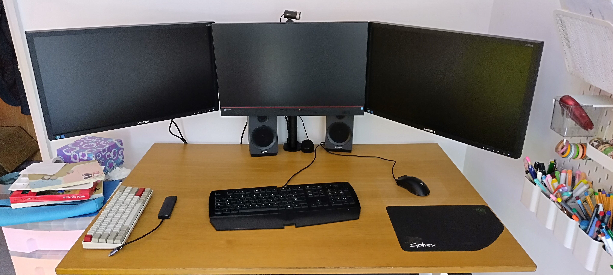

# December

## **10/12/24**&#x20;

This shit's feckin hard. Much regrets for not starting my cyber career sooner.

## **17/12/24 15:15**&#x20;

Just getting over the flu. :thermometer\_face: Learning Hashing Basics from THM. Eva at work at College. Cold hand, cold feet, full belly full of beans, bad posture, need new chair and desk set up. I feel like a gremlin. Let's keep this diary safe and sound.

## **27/12/24 11:53**&#x20;

First day with new setup. Just realised my old Razer keyboard doesn't have this key "|" Need to swap it with a boring old Dell keyboard. Still need to get a cable for my third monitor. Evicka dela nehty, I Hack, I Conquer. It's been a week since I last done any cyber. Much to do, such little time. Advent of Cyber 2024, Day 21 to do today.&#x20;

&#x20;

## **28/12/24 14:51**&#x20;

Second day with my setup, new keyboard installed, still only 2 monitors working. Evicka dropped of at the airport. I have 3 days to hack. Jon Morris tonight, and then we hack. Day 22 of Cyber Advent '24. Learning about Kubernets and DFIR. I worry about getting a job in Cyber. Office people scary. "Wednesdays, am I right" - Ginna Linneti. In Borat voice: "My wiiiifeee" - Bob Belcher Learn all the things = get a fancy job = FIRE in Scotland or somewhere.&#x20;

## 29/12/24 10:18

I hack today, all day. Let's see how much work I can get done. Starting with yesterday's task. Hopefully I can get THM advent calendar done today. Deadline is 31st of December.&#x20;

Day 22 done. Hated it. Shite teacher. Didn't explain a thing.

Day 23 done. Loved it, ez pz lemon squeeezyy. John the Ripper rulez

Day 24 Done. much fun was had. Much struglles too. Advent Calendar of 2024 finished!

On to the John the Ripper: The Basics
