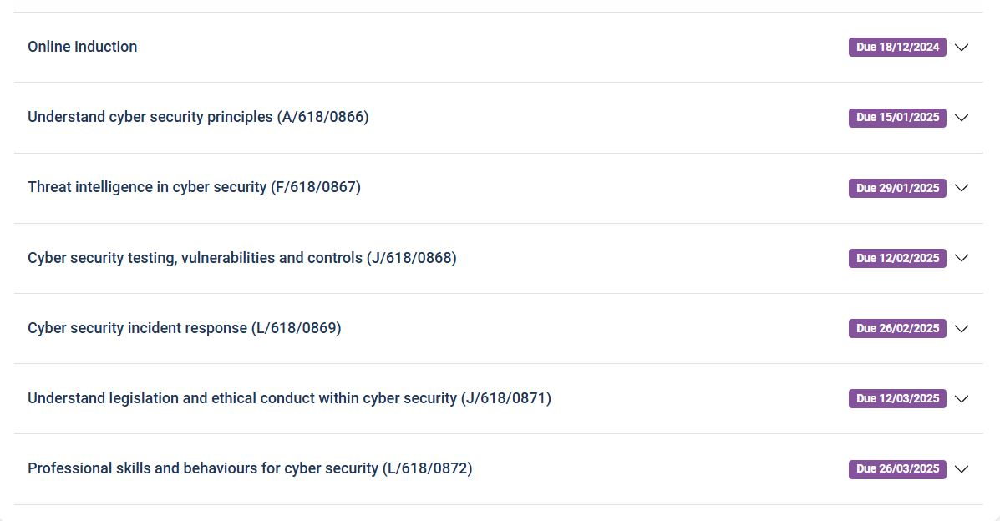
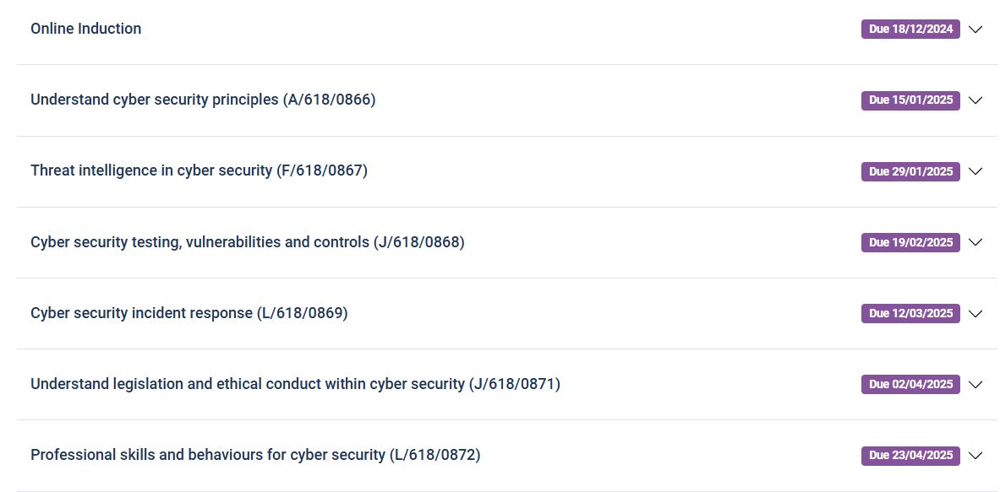

# February

## 2/2/25 15:10

Still ill, but finally got feedback for Unit 1, woohoo.  I passed, so that's nice, I'm 17% done with CC. All the answers combined was \~ 8k words,  which is ludicrous, so for Unit 2 I tried to minimise it, it ended up with \~ 7k , hopefully I'll pass that too. For Unit 3 I'll try to be even more concise. Deadline for Unit 3 is 19/2, which leaves only one, what I'm gonna call a 'Cyber Wednesday' which is a once a fortnight day-off from my boring work.

## 3/2/25 17:22

All day at Mairin's today, so I'm tired, but going to try and do at least one question "Consider mitigations following cyber security testing (AC 1.4)"

## 4/2/25 14:05

Trying to do a little of CC everyday, if I have the time, I'm hoping to finish way before the Final course completion date - 23/04/2025. That leaves 3 weeks for each unit. Best case scenario is I do a unit every 2 weeks, which would mean I would finish on the 26/3. Which is a whole month earlier. See attached screenshot of the altered dates.

&#x20;Including today I have 50 days left to in personal deadline. And I have 11 question left in Unit 3, 12 question in Unit 4, 6 questions in Unit 5, and 15 question in the last unit. That's 43 questions left. If I can do a question a day, I could finish even earlier ^\_^

<figure><figcaption>
Altered, personal target dates
</figcaption></figure>

<figure><figcaption>
Original dates
</figcaption></figure>

### 04/02 17:53

Another question(1.7) done, only 42 more to do. Now a short break and then back to it?&#x20;

### 04/02 19:33

AC 2.1 nearly done. Much tired, brain fried.&#x20;

## 05/02 16:14

Still tired from yesterday. I have just under 3 hours of uninterrupted time for cyber. I think I'll finish AC 2.1 and then maybe I'll do THM. I feel like just playing cs2 and eating junk food. mmmhmmm V Shack mmmm. I find it difficult to start.&#x20;

### 05/02 17:03&#x20;

AC 2.1 done. Tried to register at ICS2 for Certification in Cyber, their website don't work and it won't let me :(  On to THM, learning Metasploit

## 06/02 19:25

Much tired, gonna try to do one question. then maybe cs2. or maybe sleep :sleeping: Enrolled into ICS2 CC course for free today. Need to figure out how and what and where about it all.

## 07/02 13:16

Aim: 1 question for CC, then maybe THM: Metasploit?

### 07/02 15:26

Managed to do 2 questions and start a third. I think this may be enough for the time being. Household chores await.

## 10/2 10:01

Body very tired after putting in new bathroom floor all weekend, thankfully I have a day off today. Let's see how much we can get done today. I'll go make coffee, get changed and then start.

### 10/2 10:20&#x20;

Coffee got, clothes on, glasses cleaned, chair and table set to correct position and height respectively, music on. Let's go.

## 12/2 11:30

Signed up for Blended Learning session for L3 Cyber Security online thingy on Event Brite. It starts in half an hour.  Finished making my sheets to do list for all the questions for my CC



## 13/2 10:13

Played with gobuster, dirbuster, nikto and nmap, trying to find things about [https://www.eassessorpro.co.uk/](https://www.eassessorpro.co.uk/learner/courses). So far only found /chat2 nothing else too interesting.

## Sunday 16/02 15:06

I want to try experimenting with the listed above on my dad's website and record my findings. The Result ->> [https://cyber-11.gitbook.io/i-hack-i-conquer/random-experiments/web-enum-of-advis-marketing.cz](https://cyber-11.gitbook.io/i-hack-i-conquer/random-experiments/web-enum-of-advis-marketing.cz)

## Monday 17/02 09:29

In March I'll start this page latest entry at the top...scrolling all the way down is annoying. I've started Unit 4 at CC, it's about incident response plan. I've got a headache :-/ . I'm back in my room/laundry room as Eva's is working from home this week. I'll need to review my yesterday's experiment, specifically how to record my findings.

### Monday 17/02  13:39

Managed to get 3 questions done on CC. All without AI help. Enrolled in Cisco Networking Academy- Ethical Hacker. Looks promising, looks much better than CC, but there doesn't seem to be any labs like on THM. There are screenshots of command line and various examples of what command does what, so thats nice. I wonder if ever will I read these log entries. If cisco academy proves to be any good, maybe ill do more. [https://www.cisco.com/c/m/en\_sg/partners/cisco-networking-academy/index.html#\~start-your-it-learning-journey-now](https://www.cisco.com/c/m/en_sg/partners/cisco-networking-academy/index.html#~start-your-it-learning-journey-now) There seesm to be loads of courses for free including python and Linux

## Saturday 22nd 13:08

I don't really feel like doing any CC today. All the question i need to do are so boring. Explain why it is important to maintain an up to date cyber security incident log (AC 2.1), Explain the steps to be included within a cyber security incident response plan (AC 2.2),Explain why it is important to have a cyber security incident response plan (AC 2.3)... I have no interest in this rn. Maybe I'll try to do one. I have 35 questions to do, 33 days untill my personal deadline. I regret agreeing to help Mary with her shitty house. Need to buy a new battery for her smokealarm, new light switch and fix her stupid shower on Wednesday.  And at 12pm I have Teams meeting with CC tutor.&#x20;

## Saturday 22nd 13:22

Just orderd all the necesary things for Mary from screwfix. I'll watch a video on how to install  2 gang lightswitch. Done. Feel a bit more confident, might have a look at my own switches before Wednesday.  I feel less stressed about Wednesday now. I'll drop off Eva at work, pickup stuff from screwfix, and then head to Mary. Then home for 12, if all goes well.

## Wednesday 26th 11:50

10 mins till CC tutor meeting on Teams. Hopefully it'll be just me again. As this is supposed to be for unit 3 which I have already done, and need to talk about unit 4.

Job at Mary's is done. It went well, earned ££, need to comeback as the firealarm was broken by Mary, so I've ordered a new one. Not sure when i'm going back.

[kufreh.sampson@learningcurvegroup.co.uk](mailto:kufreh.sampson@learningcurvegroup.co.uk)

&#x20;Look at coding practices at Learning curve Group

## Friday 28th 18:32

Last log entry of the month. 27 days till my personal deadline, 34 questions left. I'm planning on spending today, tomorrow and Sunday evening to work on CC.

## Friday 28th  20:09

Another question done. 33 questions done. I'm not sure if I can finish on time for my deadline. The weather is starting to feel warmer and more inviting, people are coming out of hibernation and want to do stuff :unamused: Not a lot of money in my bank account, so I begrudgingly accept jobs I don't want to do. :disappointed\_relieved: I just want to cyber and play with vpn, virtual machines and tor and fuck around, I mean learn.

