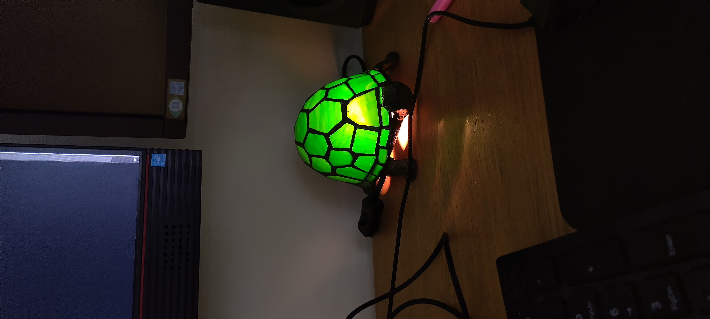

# January

## 03/01/25 16:34

First day of 2025 doing cyber. Let's see how far I can get in a year. Currently doing lvl 3 cyber on [https://www.eassessorpro.co.uk/](https://www.eassessorpro.co.uk/)

## 04/01/25 09:47

Doing lvl 3 cyber. Currently learning about grey hat hacking and Certified penetration tester. Much reading, much writing, the [https://www.eassessorpro.co.uk/](https://www.eassessorpro.co.uk/)  is a shite website with shite editing tools. No autocorrect!?

## 06/01/25 19:05

Still doing lvl 3 cyber college. currently doing this Q Identify key sectors that are most vulnerable to a cyber-attack (AC 2.5)

## 07/01/25 19:45

Doing this : Compare the motivations for a cyber-attack in key sectors (AC 2.6) at the "Cyber College". So far, both the tutor and the help staff actually very unhelpful.  Still don't know whether it's pass/fail situation or pass, merit, distinction deal....

## 08/01/25 19:11

Taking a break from Cyber College as I still don't know how it's graded. Doing THM tonight. [https://tryhackme.com/r/room/monikerlink](https://tryhackme.com/r/room/monikerlink) on the to do list today.

## 10/01/25 13:58

Finally received an email from cyber college. It's just pass/fail. Much disappointment. But it means I can spend less time on it as I don't have to try so hard. Really wanted to get a distinction, oh well... The planned end date for this course is: **23/04/2025. Let's see if I can finish before that.**

## 15/01/25 08:52

Full day of cyber today. Dreading cyber college, it's very boring and soul sucking. It's sucking all the joy out of learning and out of cyber. Looking forward to receiving feedback on my Unit 1. Doing Unit 2 now - Threat intelligence in cyber security.

## 17/01/25 12:34

On the 15th of Jan, I got half a unit done. I'm hoping this trend will continue and I will be done in no time. Hopefully it will all pass. Reallllllyyyy don't wan't to do any of it again.. Just had 2 espreresooo, i'm very hyperr. Section 2 of unit 2 now. Onwards!

## 21/01/25 15:37

Long day at work, I decided to do a revision of my last answered question -  AC 2.2. Found a way how to improve it. I'm anxious about receiving marking for my first submission. I think I did a good job, but not knowing is making me question if my current work is enough or whether I should spend more hours at it.&#x20;

Started learning Python on my phone, I have 2 apps: Sololearn and Python X. Both suck balls as they both constantly bother me with upgrading to premium :/ I've started Hack The Box Python course, so far it looks good but more complicated than the mobile apps. Still want to try Udemy and other sources of learning Python.

2nd meditation at the Tara Buddhist centre this evening.

## 24/01/25 13:02

Doing THM this Friday. I think that this will be my schedule until I finish Cyber College, THM on Fridays, CC once a fortnight on Wednesdays. THM or CC on weekends or evenings.&#x20;

Revisiting Metasploit as I have no notes on it here. I remember Metasploit to be fairly easy, let's see how much I can remember.

## 27/01/25 11:48

Ill again, fml. I've been more ill in the past 2 years than I have in the last decade. Getting sick of it. Always the same thing, sore throat, headache, snot, stomach. I'm in bed with Dublin, might watch professor Messer videos, not sure if I can manage CC or THM on a little laptop screen and limited brain power.

## 28/01/25 12:27

Still again, but feeling better. Gonna try learning at a desk today. I have tea, water, full belly, blanket and my cyber buddy Jimmy the turtle (named after Real life turtle called Jimmy Townend) see pic:&#x20;

Deadline for unit 2 at CC is tomorrow so I have to get everything done today and tomorrow.

<figure><figcaption>
Jimmy
</figcaption></figure>

## 28/01/25 15:52

Done for today, managed to do 2 questions, one boring about threat models :tired\_face: and one fun about malware :thumbsup: Did 2 loads of laundry, had good healthy snacks and cooked a healthy dinner for us :heart\_decoration:

## 29/01/25 09:21

Only 5 questions on CC. All the questions seem pretty fun, they're all about malware, social engineering, osint etc... I'm still ill meeeh.

