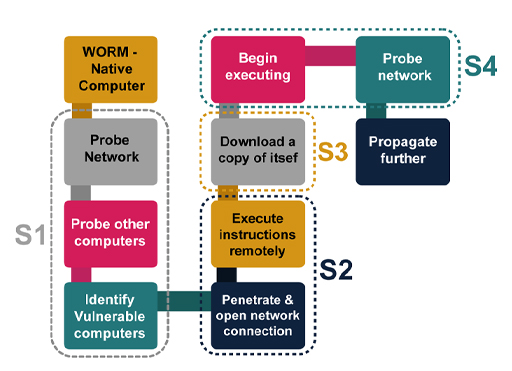
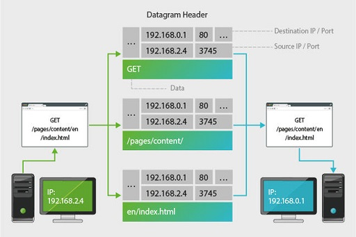
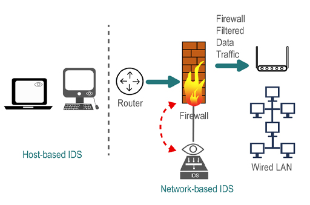
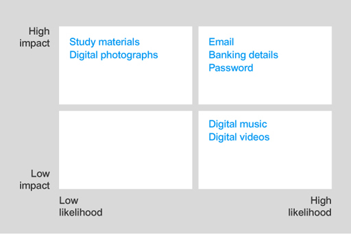

# Open Uni - Cyber Foundations - Notes

## Password Managers

* [LastPass](https://lastpass.com/) is available for a range of operating systems, including mobile devices. It can generate and store passwords, and manage them across multiple devices.
* [1Password](https://agilebits.com/onepassword) is available for Windows and Mac computers as well as mobile devices running iOS, Android and Windows Phone. As well as generating and storing passwords, 1Password can be used to hold other confidential documents. It offers password synchronisation through the free Dropbox cloud service where encrypted copies of all 1Password data are shared between your machines.
* [KeePass](https://keepass.info/index.html) is available for Windows, Mac and Linux operating systems. It is an open-source password manager

## Week 3 - Malware

<figure><figcaption></figcaption></figure>

<figure><figcaption>
<a href="https://www.sophos.com/en-us/medialibrary/PDFs/other/sophosthreatsaurusaz.pdf?la=en?">https://www.sophos.com/en-us/medialibrary/PDFs/other/sophosthreatsaurusaz.pdf?la=en?</a>
</figcaption></figure>

### Email phishing

The use of electronic technologies to perform phishing attacks was described in the late 1980s, but the term did not become commonplace until the mid 1990s when a program called AOHell allowed AOL users to impersonate other people (including the founder of AOL itself).

## Week 4 - Networking

<figure><figcaption></figcaption></figure>

### Table 4.1: Differences between the internet and world wide web

| The Internet                                                                | The World Wide Web (WWW)                                                                            |
| --------------------------------------------------------------------------- | --------------------------------------------------------------------------------------------------- |
| Beginnings in the 1960s                                                     | Early 1990s                                                                                         |
| Interconnectivity Infrastructure                                            | Computer application                                                                                |
| Uses several computing devices terms as ‘routers’ for the interconnectivity | User application front-end for information access (Web browser)                                     |
| Supports communication between computers and their applications             | Server application for storing and retrieving data to serve remote requests coming via the Internet |
| Primarily uses TCP and IP                                                   | Uses HTTP, HTTPS                                                                                    |
| Invented by a team of scientists in USA                                     | Invented by a British scientist at CERN, Switzerland                                                |



## Week 6

* Network Intrusion Detection System (NIDS), which is responsible for monitoring data passing over a network.
* Host Intrusion Detection System (HIDS), which is responsible for monitoring data to and from a computer.

<figure><figcaption></figcaption></figure>

### Table 6.1: IDS vs. IPS

<table><thead><tr><th width="111"></th><th>IDS Intrusion Detection System</th><th>IPS  Intrusion Prevention or Protection System</th></tr></thead><tbody><tr><td>Where in the network?</td><td>Supporting the firewall and with the capability of inspecting all the incoming and outgoing data traffic</td><td>Between the firewall and the router connecting to the internet</td></tr><tr><td>Operation</td><td>Passive – inspects the data traffic and alerts a companion device such a Firewall</td><td>Active – performs IPS functions and also blocks suspicious traffic from reaching the firewall</td></tr><tr><td>Detection</td><td>Anomaly detection – statistical anomaly, signature-based or rule-based, and misuse detection</td><td>Anomaly detection – statistical anomaly, signature-based or rule-based, and misuse detection</td></tr></tbody></table>

<table><thead><tr><th width="109"></th><th>Firewall</th><th>IPS Intrusion Prevention or Protection System</th></tr></thead><tbody><tr><td>Where in the network?</td><td>At the perimeter of the network, before the internet router</td><td>Between the firewall and the router connecting to the internet</td></tr><tr><td>Operation</td><td>Active – inspects incoming IP datagrams and blocks or permits them through</td><td>Active – performs IPS functions and also blocks suspicious traffic from reaching the firewall</td></tr><tr><td>Detection</td><td>Rule-based blocking of IP datagrams based on source and destination addresses and service port numbers</td><td>Anomaly detection – statistical anomaly, signature-based or rule-based, and misuse detection</td></tr><tr><td>Integration</td><td>Firewalls deployed for small networks could have the IPS functionality integrated</td><td>Dedicated functionality</td></tr></tbody></table>

## Week 7

### The Investigatory Powers Act 2016

IPA allows certain public bodies to access communications records from communication providers, such as telephone companies and internet service providers, when necessary and proportionate to do so for a specific investigation. These records may include the <mark style="color:yellow;">**names, addresses and telephone numbers of individuals, the time and duration of calls, the source and destination of emails and the location of mobile devices**</mark>. The IPA extended the record collection powers of RIPA(Regulation of Investigatory Powers Act 2000) to include a requirement that communications companies retain up to 12 months of data on websites (but not specific webpages) visited by customers.

More intrusive techniques are subject to higher levels of authorisation. Another section of IPA stipulates that the interception of the contents of a communications (such as t**elephone calls, emails and the details of specific webpages visited**) must be authorised under a warrant issued by the Secretary of State.

### The Computer Misuse Act 1990

The CMA came about, in part, because of a 1988 case where two hackers broke into the British Telecom Prestel network and obtained access to user accounts including that of Prince Philip.

Prestel was a text-based interactive information system developed by the UK Post Office in the late 1970s. Users could browse numbered pages of text (similar to the contemporaneous Ceefax and Teletext information services) on their television as well as send electronic messages to other Prestel users. Prestel services were expensive and the system did not become widely used, although Prestel technology was sold to many other telecom companies. Prestel was gradually sold off in the early 1990s as the internet became available to domestic users.

The two hackers were originally tried and convicted under a law concerned with forgery and counterfeiting, but the conviction was overturned by higher courts who concluded that the Forgery and Counterfeiting Act 1981 had never been intended to be used for this purpose. <mark style="color:yellow;">**This led the majority of legal experts to conclude that hacking was not actually illegal in Britain at the time.**</mark>

### The Fraud Act 2006

The Fraud Act 2006 was introduced to simplify a notoriously complex Act of Parliament called the Theft Act.

The previous law defined a large number of types of fraud, often tied to specific circumstances, that made for complex cases that were difficult to prosecute and for juries to understand. <mark style="color:yellow;">In fact, it wasn’t until 1996 that obtaining money from a fraudulent bank transfer was specifically illegal in the UK!</mark>

he Fraud Act defines fraud in three ways:

* false representation
* failing to disclose information
* abusing power.

In each case, the defendant’s <mark style="color:red;">conduct must be dishonest with the intention of making a gain</mark>, <mark style="color:red;">or must cause a loss (or the risk of a loss</mark>) to another person or individual. Crucially, no actual gain or loss needs to be proved – the fraud might have been unsuccessful or it was stopped before it could take place.

The Fraud Act can be used against anyone attempting to perform fraud whether or not it takes place over the internet. However, Section 11 of the Act makes specific reference to electronic fraud and can be used to prosecute in response to:

* dishonestly obtaining electronic communications services such as a telephone, ISP or satellite television subscription
* cloning mobile phones so that calls made on one handset are billed to another
* reprogramming mobile phones to interfere with their operation or change their unique identifier information
* breaking encryption on encrypted communications services such as subscription television services or telephone conversations.

When you believe that your computer has been infected by a virus, or other malware, there are recommended actions that should be taken. Using the drop-down list, put these into the correct order.

<mark style="color:red;">Step 1: update antivirus software</mark>

<mark style="color:red;">Step 2: disconnect from any network</mark>

<mark style="color:red;">Step 3: restart in ‘SafeMode’</mark>

<mark style="color:red;">Step 4: initiate a complete disk scan</mark>

The computer must be isolated from any networks to prevent unintentional distribution of the virus or malware. However, before doing this, any antivirus software should be updated to allow a complete disk scan. Hence, that is the first step, followed by disconnecting the computer from the network.

Then the computer should be restarted in ‘SafeMode’ to prevent any unintentional use of network connections and limit the number of applications running. This should stop most malware from doing more damage. Finally, a complete disk scan should be undertaken to check for any issues

## Week 8

"An attack on the digital music or videos will have low impact, since these can be downloaded again easily. However, <mark style="color:yellow;">this will have high likelihood because these assets can be easily copied and sold,</mark> this making these attractive to an attacker. Therefore, they go in the low-high box." -????I'm sorry what? Attacker is going to steal your digital music and sell it online? lol :rofl: Open Uni what?

<figure><figcaption>
lol
</figcaption></figure>
