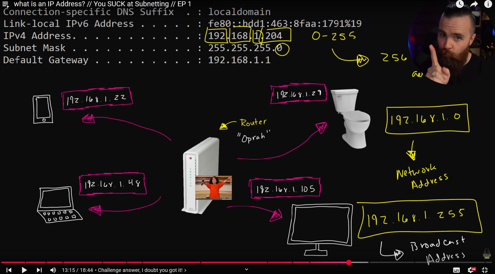
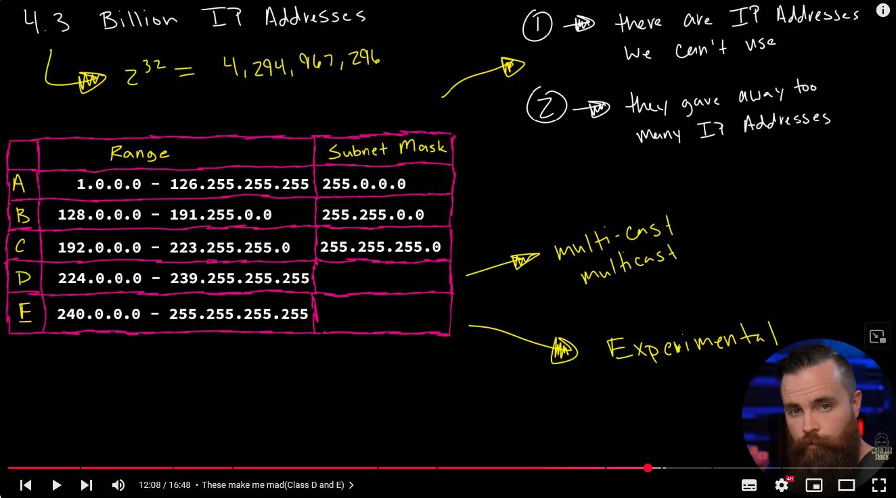
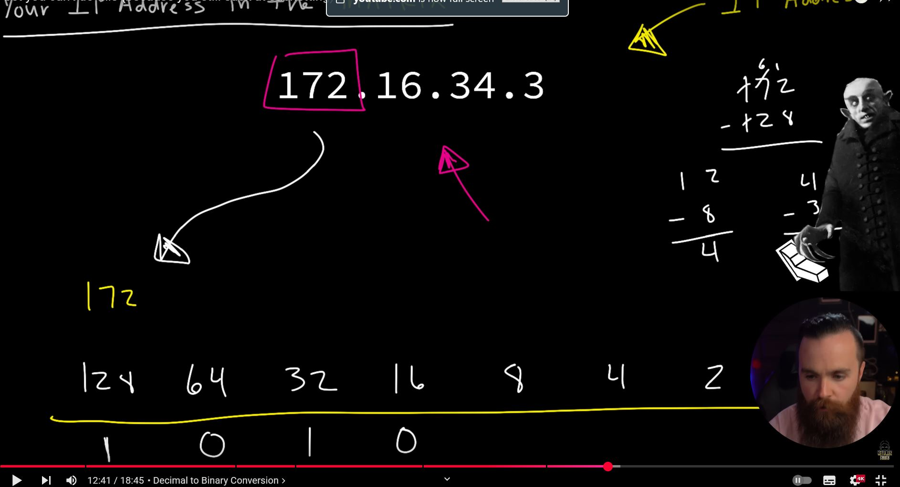
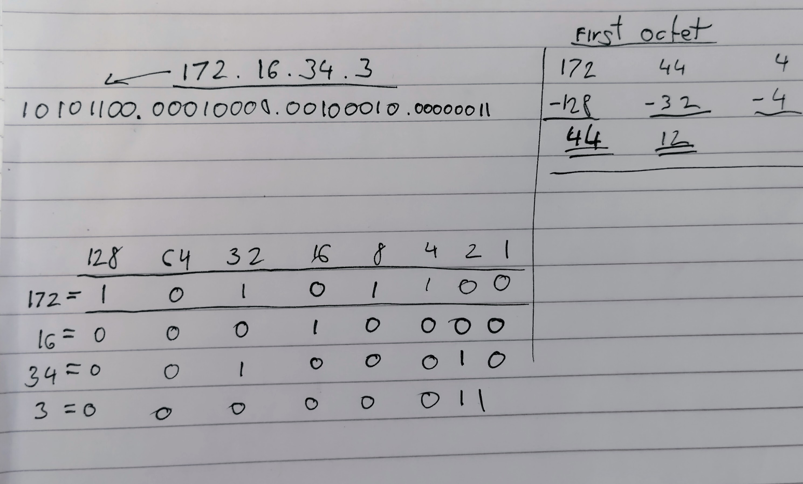
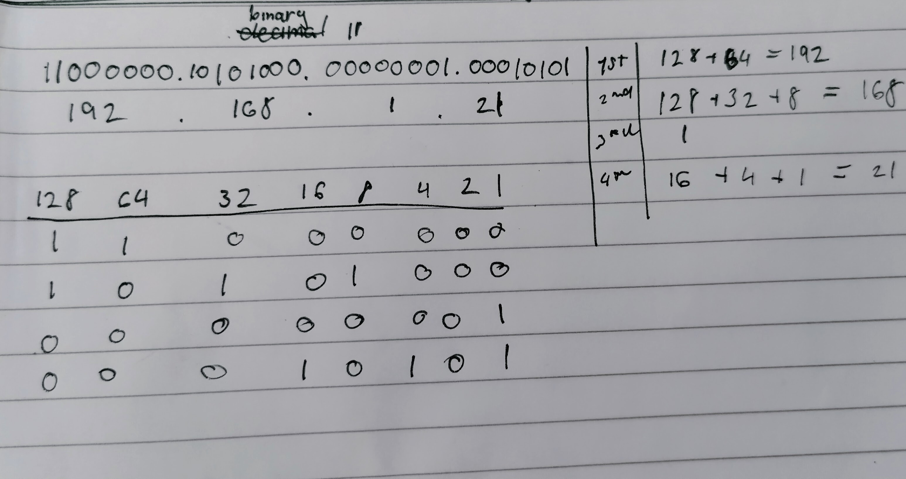

# IP Addresses and Subnets

An IP address comprises four octets, i.e., 32 bits. Being 8 bits, an octet allows us to represent a decimal number between 0 and 255.

<figure><figcaption></figcaption></figure>

At the risk of oversimplifying things, the 0 and 255 are reserved for the network and broadcast addresses, respectively. In other words, `192.168.1.0` is the network address, while `192.168.1.255` is the broadcast address. Sending to the broadcast address targets all the hosts on the network

You can look up your IP address on the MS Windows command line using the command `ipconfig`. On Linux and UNIX-based systems, you can issue the command `ifconfig` or `ip address show`, which can be typed as `ip a s`. In the terminal window below, we show `ifconfig`.

## Private addresses

Private IP address cannot reach or be reached from the outside world. For a private IP address to access the Internet, the router must have a public IP address and must support Network Address Translation (NAT)

RFC 1918 defines the following three ranges of private IP addresses:

* `10.0.0.0` - `10.255.255.255` (`10/8`)
* `172.16.0.0` - `172.31.255.255` (`172.16/12`)
* `192.168.0.0` - `192.168.255.255` (`192.168/16`)

Minimum of 2 addresses always reserved as&#x20;

* Network address - `192.168.1.0`
* Broadcast address -`192.168.1.255`&#x20;
* Router ip/default gateway - `192.168.1.1`

<figure><figcaption></figcaption></figure>

## The IP address 127.0.0.1  is called the loopback address&#x20;

## Routing

A router forwards data packets to the proper network. Usually, a data packet passes through multiple routers before it reaches its final destination. The router functions at layer 3, inspecting the IP address and forwarding the packet to the best network (router) so the packet gets closer to its destination.

<figure><figcaption></figcaption></figure>

## IPv4 Addresses Classes

<figure><figcaption></figcaption></figure>

* **Class A**
  * **`0---`** : If the first bit of an IPv4 address is “0”, this means that the address is part of class A. This means that any address from **`0.0.0.0` to `127.255.255.255`** is in class A.
* **Class B**
  * **`10--`** : Class B includes any address from **`128.0.0.0` to `191.255.255.255`**. This represents the addresses that have a “1” for their first bit, but don’t have a “1” for their second bit.
* **Class C**
  * **`110-`** : Class C is defined as the addresses ranging from **`192.0.0.0` to `223.255.255.255`**. This represents all of the addresses with a “1” for their first two bits, but without a “1” for their third bit.
* **Class D**
  * **`1110`** : This class includes addresses that have “111” as their first three bits, but a “0” for the next bit. This address range includes addresses from **`224.0.0.0` to `239.255.255.255`**.
* **Class E**
  * **`1111`** : This class defines addresses between **`240.0.0.0` and `255.255.255.255`**. Any address that begins with four “1” bits is included in this class.

### Class D IP address definition [https://nordvpn.com/cybersecurity/glossary/class-d-ip-address/](https://nordvpn.com/cybersecurity/glossary/class-d-ip-address/)

Class D IP address is an IP address not assigned to individual hosts but rather used for multicasting. Through the use of multicasting, a single host is able to simultaneously transmit a single data stream to thousands of other servers located across the internet. IP addresses that belong to class D have the value 1110 assigned to their higher-order bits in the first octet of their addresses at all times. The remaining bits make up an address that can be recognized by any hosts interested. Streaming audio and video content is a common application for it, as seen with IP-based cable TV networks. Another illustration of this is the dissemination of real-time data on the stock market from a single source to several brokerage firms. There is no sub-net mask associated with the Class D network.

### Additional features:

* The public IP range is 224.0.0.0 to 239.255.255.255.
* The number of networks is N/A.
* The number of hosts per network is multicasting.
* The first octet value ranges from 224 to 239.

### Class E IP address definition [https://nordvpn.com/cybersecurity/glossary/class-e-ip-address/](https://nordvpn.com/cybersecurity/glossary/class-e-ip-address/)

Class E IP address is an IP address used for research by individuals responsible for internet networking and IP address development, management, and research. To create a Class E IP address, you must set the first four network address bits to 1, enabling you to use addresses in the range 240.0.0.0 to 255.255.255.255. Continuously set to 1111, the first octet’s higher-order bits of Class E have this value. The E class is not available for use, and its purpose is ambiguous. Due to this, many different network implementations will ignore these addresses, considering them undefined or unlawful. There is no sub-net mask associated with the Class E network.

### Additional features:

* The range is 240.0.0.0 to 255.255.255.255.
* The number of networks is N/A.
* The number of hosts per network is Research/Reserved/Experimental.
* The first octet value ranges from 240 to 255.

## Subnets

The process of dividing a network into smaller network sections is called **subnetting.**

Each address space is divided into a network portion and a host portion. The amount of the address that each of these take up is dependent on the class that the address belongs to. For instance, for class C addresses, the first 3 octets are used to describe the network. For the address `192.168.0.15`, the `192.168.0` portion describes the network and the `15` describes the host.

## Converting IP address decimal to binary and vice versa

[https://www.youtube.com/watch?v=2-i5x8KCfII](https://www.youtube.com/watch?v=2-i5x8KCfII)

<figure><figcaption></figcaption></figure>

### example IP address  172.16.34.3

start with first octet and see if it would fit in 128 if so then write 1, whatever number is left after subtraction, see if would fit in 64, 32, etc

### 128 64 32 16 8 4 2 1

<figure><figcaption></figcaption></figure>

### Binary to decimal

<figure><figcaption></figcaption></figure>
