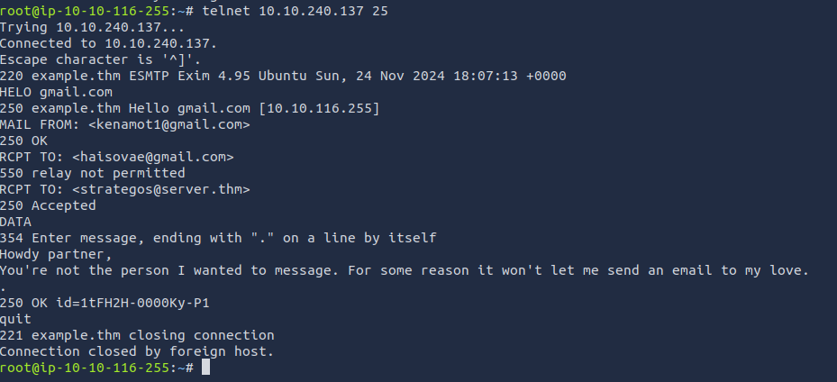

# Sending email: SMTP (Simple Mail Transfer Protocol)

Email delivery over the Internet requires the following components:

1. Mail Submission Agent (MSA)
2. Mail Transfer Agent (MTA)
3. Mail Delivery Agent (MDA)
4. Mail User Agent (MUA)

<figure><figcaption>
General way of handling emails
</figcaption></figure>

1. A Mail User Agent (MUA), or simply an email client, has an email message to be sent. The MUA connects to a Mail Submission Agent (MSA) to send its message.
2. The MSA receives the message, checks for any errors before transferring it to the Mail Transfer Agent (MTA) server, commonly hosted on the same server.
3. The MTA will send the email message to the MTA of the recipient. The MTA can also function as a Mail Submission Agent (MSA).
4. A typical setup would have the MTA server also functioning as a Mail Delivery Agent (MDA).
5. The recipient will collect its email from the MDA using their email client.

## telnet commands:

* `HELO` or `EHLO` e.g. “HELO client.example.com”)
* `MAIL FROM` specifies the sender’s email address
* `RCPT TO` specifies the recipient’s email address
* `DATA` indicates that the client will begin sending the content of the email message.
* `.` is sent on a line by itself to indicate the end of the

More on commands on [https://www.samlogic.net/articles/smtp-commands-reference.htm](https://www.samlogic.net/articles/smtp-commands-reference.htm)

<figure><figcaption></figcaption></figure>

Wireshark example of similar exchange&#x20;

<figure><figcaption></figcaption></figure>
