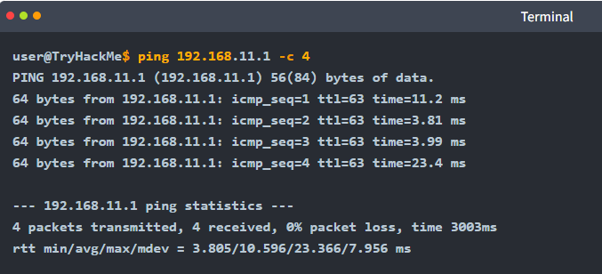
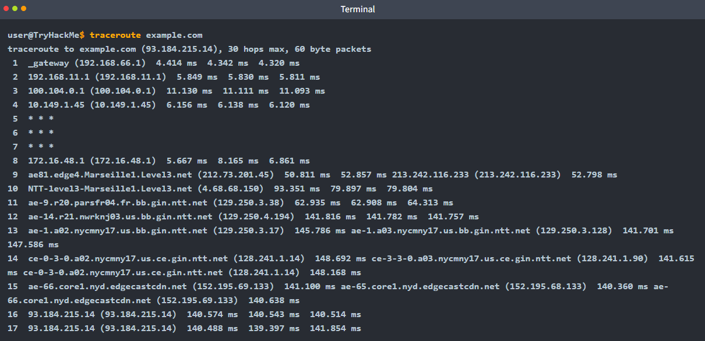
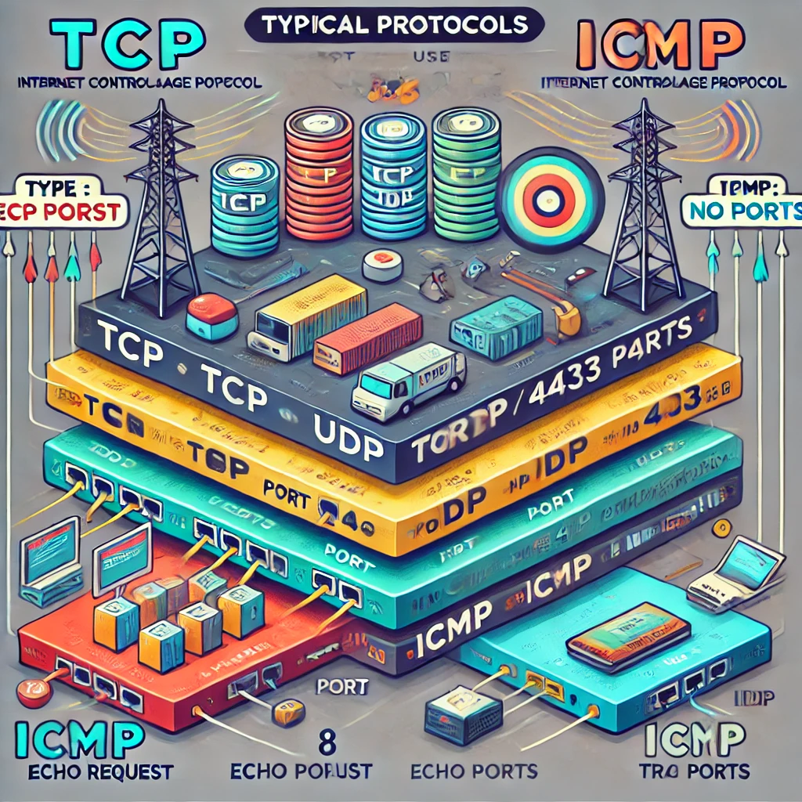

# ICMP: Troubleshooting Networks

Two popular commands rely on ICMP, and they are instrumental in network troubleshooting and network security. The commands are:

* `ping`: This command uses ICMP to test connectivity to a target system and measures the round-trip time (RTT). In other words, it can be used to learn that the target is alive and that its reply can reach our system.
* `traceroute`: This command is called `traceroute` on Linux and UNIX-like systems and `tracert` on MS Windows systems. It uses ICMP to discover the route from your host to the target.

## Ping

Many things might prevent us from getting a reply. In addition to the possibility of the target system being offline or shut down, a firewall along the path might block the necessary packets for `ping` to work.

<figure><figcaption><p>The output shows no packet loss; moreover, it calculates the minimum, average, maximum, and standard deviation (mdev) of the round-trip time (RTT).im</p></figcaption></figure>


```bash
ping 192.168.11.1 -c 4
```

-c to tell the ping to stop after sending four packets

## Traceroute

The Internet protocol has a field called Time-to-Live (TTL) that indicates the maximum number of routers a packet can travel through before it is dropped.

When the TTL reaches zero, the router drops the packet and sends an ICMP Time Exceeded message (ICMP Type `11`)&#x20;

For all the ICMP types: [https://www.iana.org/assignments/icmp-parameters/icmp-parameters.xhtml](https://www.iana.org/assignments/icmp-parameters/icmp-parameters.xhtml)

<figure><figcaption><p>The traversed route might change as we rerun the command.</p></figcaption></figure>



AI's lame effort at visualising why ICMP don't use ports...

<div><figure><figcaption></figcaption></figure> <figure><figcaption></figcaption></figure> <figure><figcaption></figcaption></figure></div>
