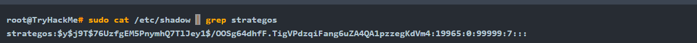

# Recognising Password Hashes

## Linux Passwords

Password hashes are stored in `/etc/shadow`, which is normally only readable by root. They used to be stored in `/etc/passwd`, which was readable by everyone.

The encrypted password field contains the hashed passphrase with four components: prefix (algorithm id), options (parameters), salt, and hash. It is saved in the format `$prefix$options$salt$hash`. The prefix makes it easy to recognise Unix and Linux-style passwords; it specifies the hashing algorithm used to generate the hash.

Here’s a quick table of some of the most common Unix-style password prefixes you might encounter. They are listed in the order of decreasing strength. You can read more about them by checking the man page with `man 5 crypt`.

<table><thead><tr><th width="160">Prefix</th><th>Algorithm</th></tr></thead><tbody><tr><td><code>$y$</code></td><td>yescrypt is a scalable hashing scheme and is the default and recommended choice in new systems</td></tr><tr><td><code>$gy$</code></td><td>gost-yescrypt uses the GOST R 34.11-2012 hash function and the yescrypt hashing method</td></tr><tr><td><code>$7$</code></td><td>scrypt is a password-based key derivation function</td></tr><tr><td><code>$2b$</code>, <code>$2y$</code>, <code>$2a$</code>, <code>$2x$</code></td><td>bcrypt is a hash based on the Blowfish block cipher originally developed for OpenBSD but supported on a recent version of FreeBSD, NetBSD, Solaris 10 and newer, and several Linux distributions</td></tr><tr><td><code>$6$</code></td><td>sha512crypt is a hash based on SHA-2 with 512-bit output originally developed for GNU libc and commonly used on (older) Linux systems</td></tr><tr><td><code>$md5</code></td><td>SunMD5 is a hash based on the MD5 algorithm originally developed for Solaris</td></tr><tr><td><code>$1$</code></td><td>md5crypt is a hash based on the MD5 algorithm originally developed for FreeBSD</td></tr></tbody></table>

\

<figure><figcaption>
The fields are separated by colons. The important ones are the username and the hash algorithm, salt, and hash value. The second field has the format <code>$prefix$options$salt$hash</code>
</figcaption></figure>

In the example above, we have four parts separated by `$`:

* `y` indicates the hash algorithm used, **yescrypt**
* `j9T` is a parameter passed to the algorithm
* `76UzfgEM5PnymhQ7TlJey1` is the salt used
* `/OOSg64dhfF.TigVPdzqiFang6uZA4QA1pzzegKdVm4` is the hash value

## MS Windows Passwords

