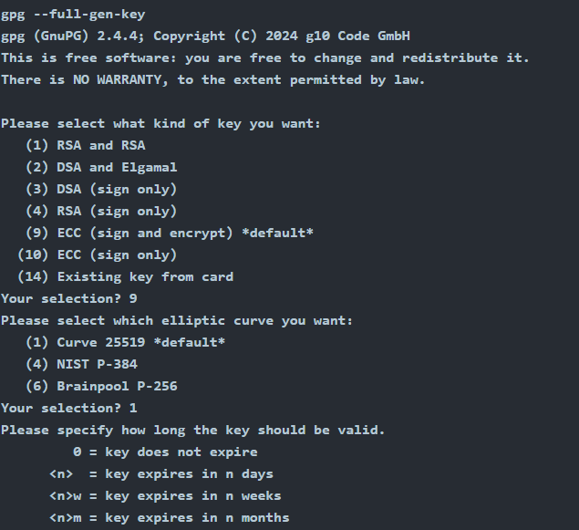

# PGP and GPG

## Pretty Good Privacy

Software that implements encryption for encrypting files, performing digital signing, and more.&#x20;

Pretty Good Privacy (PGP) is an [encryption program](https://en.wikipedia.org/wiki/Encryption_software) that provides [cryptographic](https://en.wikipedia.org/wiki/Cryptographic) [privacy](https://en.wikipedia.org/wiki/Privacy) and [authentication](https://en.wikipedia.org/wiki/Authentication) for [data communication](https://en.wikipedia.org/wiki/Data_communication). PGP is used for [signing](https://en.wikipedia.org/wiki/Digital_signature), encrypting, and decrypting texts, [e-mails](https://en.wikipedia.org/wiki/Email), files, directories, and whole disk partitions and to increase the [security](https://en.wikipedia.org/wiki/Security) of e-mail communications. [Phil Zimmermann](https://en.wikipedia.org/wiki/Phil_Zimmermann) developed PGP in 1991.[\[4\]](https://en.wikipedia.org/wiki/Pretty_Good_Privacy#cite_note-:0-4)

## GPG (GNU Privacy Guard)

GPG is commonly used in email to protect the confidentially of the email messages. Furthermore, it can be used to sign an email message and confirm its integrity.

#### Manual page for GPG :

[https://www.gnupg.org/gph/de/manual/r1023.html](https://www.gnupg.org/gph/de/manual/r1023.html)

### How to generate a key:

<figure><figcaption>
gpg --full-gen-key
</figcaption></figure>

### How to decrypt message:

Let’s say you got a new computer. All you need to do is import your key, and you can start decrypting your received messages again:

* You would use `gpg --import backup.key` to import your key from backup.key
* To decrypt your messages, you need to issue `gpg --decrypt confidential_message.gpg`

We have defined **cryptography** as the science of securing communication in the presence of adversaries. Another important science that studies how to break or bypass cryptographic systems is **cryptanalysis**. As for trying every possible password combination, we call that a **brute-force attack**. However, when we know that the password is most likely a dictionary word, it will make more sense to try words from a dictionary instead of every possible password combination; this is called a **dictionary attack**.

* **Cryptography** is the science of securing communication and data using codes and ciphers.
* **Cryptanalysis** is the study of methods to break or bypass cryptographic security systems without knowing the key.
* **Brute-Force Attack** is an attack method that involves trying every possible key or password to decrypt a message.
* **Dictionary Attack** is an attack method where the attacker tries dictionary words or combinations of them.

This room focused on public key cryptography, asymmetric cryptography, and key exchange. It gave you an essential understanding of RSA, Diffie-Hellman, SSH key pairs, digital signatures and certificates, and OpenPGP.&#x20;
