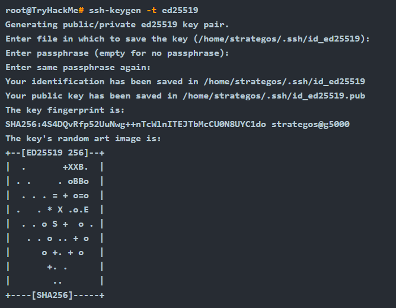

# SSH

`ssh-keygen` is the program usually used to generate key pairs. It supports various algorithms, as shown on its manual page below

* **DSA (Digital Signature Algorithm)** is a public-key cryptography algorithm specifically designed for digital signatures.
* **ECDSA (Elliptic Curve Digital Signature Algorithm)** is a variant of DSA that uses elliptic curve cryptography to provide smaller key sizes for equivalent security.
* **ECDSA-SK (ECDSA with Security Key)** is an extension of ECDSA. It incorporates hardware-based security keys for enhanced private key protection.
* **Ed25519** is a public-key signature system using EdDSA (Edwards-curve Digital Signature Algorithm) with Curve25519.
* **Ed25519-SK (Ed25519 with Security Key)** is a variant of Ed25519. Similar to ECDSA-SK, it uses a hardware-based security key for improved private key protection.

<figure><figcaption></figcaption></figure>

### Using SSH Keys to Get a “Better Shell”

During CTFs, penetration testing, and red teaming exercises, SSH keys are an excellent way to “upgrade” a reverse shell, assuming the user has login enabled. Note that www-data usually does not allow this, but regular users and root will work. Leaving an SSH key in the `authorized_keys` file on a machine can be a useful backdoor, and you don’t need to deal with any of the issues of unstabilised reverse shells like Control-C or lack of tab completion.
