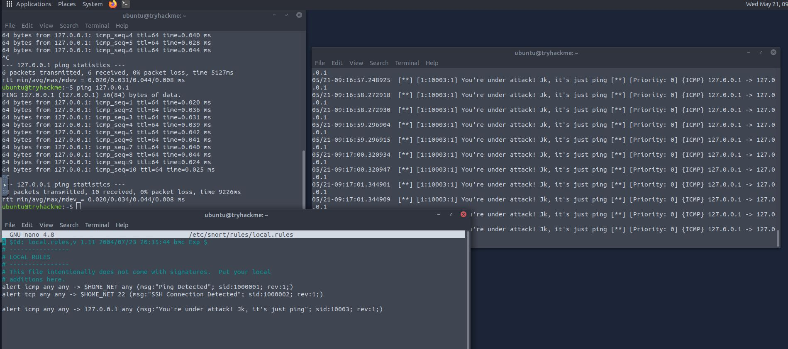
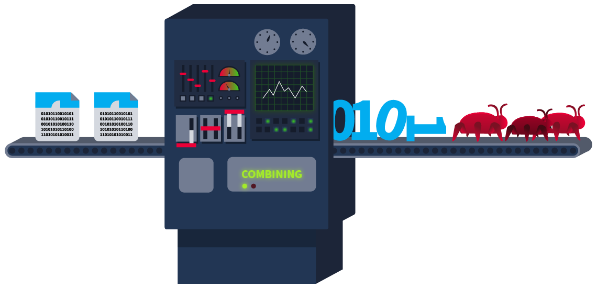
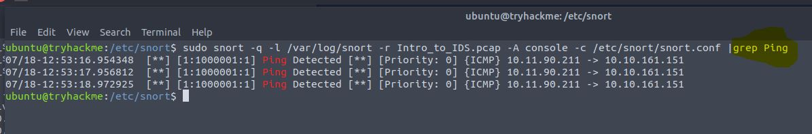

# Intrusion Detection Systems Fundamentals

## Types of IDS

**Host Intrusion Detection System (HIDS) - Installed on one host only to protect that one host**

**Network Intrusion Detection System (NIDS) -  Detects malicious activities within the whole network**

<figure><figcaption></figcaption></figure>


**Signature-based IDS** - Every attack has its unique pattern (signature). These signatures are stored by the IDS in their database, so that if the same signature attack happens again, it gets detected. The stronger the database, the more efficient IDS become. Signature-based IDS isn’t able to detect zero-day attacks.  Signature-based IDS can be a good option for covering a small threat surface. This type of IDS detects threats quickly.

**Anomaly-Based IDS** - This IDS first learns the usual behaviour on the network or systems (baseline) and performs detections if there is any deviation from the normal behaviour. This IDS can potentially detect zero-day attacks. The downside to this IDS is that it may generate a lot of false positives. This can be fixed by finetuning.

**Hybrid IDS** - This IDS combines the strengths of each approach.&#x20;

## Snort v2&#x20;

`/etc/snort`

<figure><figcaption></figcaption></figure>


<table><thead><tr><th width="99">Mode</th><th>Description</th><th>Use Case</th></tr></thead><tbody><tr><td>Packet sniffer mode</td><td>This mode reads and displays network packets without performing any analysis on them. </td><td>The network team observes some network performance issues. To diagnose the issue, they need detailed insights into the network traffic. For this purpose, they can utilize Snort’s packet sniffer mode.</td></tr><tr><td>Packet logging mode</td><td>Snort performs detection on the network traffic in real-time and displays the detections as alerts on the console for the security administrators to take action. However, in some cases, the network traffic needs to be logged for later analysis. The packet logging mode of Snort allows you to log the network traffic as a PCAP (standard packet capture format) file. This includes all the network traffic and any detections from it. Forensic investigators can use these Snort log files to perform the root cause analysis of previous attacks.</td><td>The security team needs to initiate a forensic investigation of a network attack. They would need the traffic logs to perform the root cause analysis. The network traffic logged through Snort’s packet logging mode can help them.</td></tr><tr><td>Network Intrusion Detection System mode</td><td>Snort’s NIDS mode is the primary mode that monitors network traffic in real-time and applies its rule files to identify any match to the known attack patterns stored as signatures. If there is a match, it generates an alert. This mode provides the main functionality of an IDS solution.</td><td>The security team must proactively monitor their network or systems to detect potential threats. They can leverage Snort’s NIDS mode to achieve this.</td></tr></tbody></table>

## Snort usage

<figure><figcaption><p>Rule format</p></figcaption></figure>

Firstly


```bash
sudo nano /etc/snort/rules/local.rules # to open local.rules in nano

# Add a new rule - This specific rule bellow will create an alert when Snort detects #any icmp packets from any source IP, any source port, going to our IP on any port

alert icmp any any -> 127.0.0.1 any (msg:"Loopback Ping Detected"; sid:10003; rev:1;)
```


<pre class="language-bash" data-overflow="wrap"><code class="lang-bash"><strong># This command will open a console where you can view the alerts. Note: omit -q for more information
</strong><strong>sudo snort -q -l /var/log/snort -i lo -A console -c /etc/snort/snort.conf
</strong>
# Open a new cli to test the rule and ping 127.0.0.1
ping 127.0.0.1
</code></pre>

<figure><figcaption><p>Left top window shows ping command, left bottom shows rules, right windows shows the alert.</p></figcaption></figure>

### Running Snort on PCAP files

<figure><figcaption><p>THM artists do such great work</p></figcaption></figure>


```bash
# To analyse PCAP files run this command, subsitute FILENAME.pcap with the correct name.
sudo snort -q -l /var/log/snort -r FILENAME.pcap -A console -c /etc/snort/snort.conf 
# Remember you can always use | grep command to find specific thing.
```


<figure><figcaption><p>sudo snort -q -l /var/log/snort -r Intro_to_IDS.pcap -A console -c /etc/snort/snort.conf </p></figcaption></figure>

<figure><figcaption><p>sudo snort -q -l /var/log/snort -r Intro_to_IDS.pcap -A console -c /etc/snort/snort.conf  | grep Ping</p></figcaption></figure>
