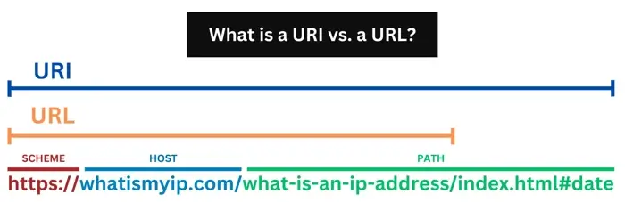
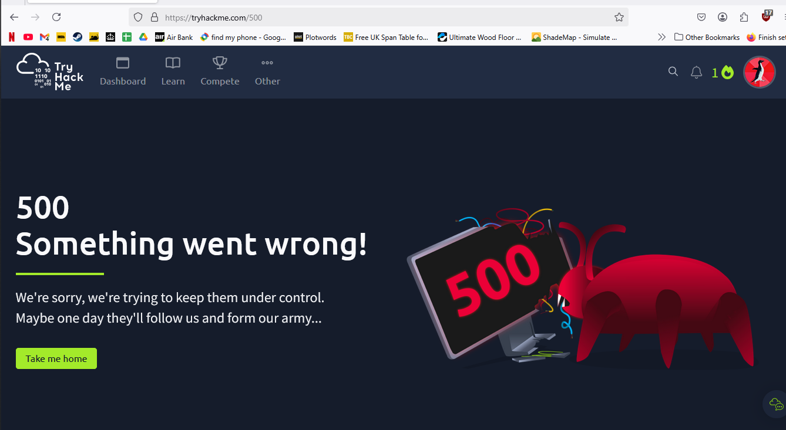

# Web Application Basics

## URL Uniform Resource Locator

Uniform Resource Locator (URL) Info about URL here: [https://url.spec.whatwg.org/](https://url.spec.whatwg.org/)

<figure><figcaption>
<a href="https://tryhackme.com/room/webapplicationbasics">https://tryhackme.com/room/webapplicationbasics</a>
</figcaption></figure>

Today I learned there's URL and URI (\<that's uppercase i )

<figure><figcaption>
<a href="https://www.whatismyip.com/static/6c8b2ff91a63e448541800241d914a57/uri-vs-url.webp">https://www.whatismyip.com/static/6c8b2ff91a63e448541800241d914a57/uri-vs-url.webp</a>
</figcaption></figure>

Examples of popular URI schemes include [`http`](https://en.wikipedia.org/wiki/Hypertext_Transfer_Protocol), [`https`](https://en.wikipedia.org/wiki/HTTP_Secure), [`ftp`](https://en.wikipedia.org/wiki/File_Transfer_Protocol), [`mailto`](https://en.wikipedia.org/wiki/Mailto), [`file`](https://en.wikipedia.org/wiki/File_URI_scheme), [`data`](https://en.wikipedia.org/wiki/Data_URI_scheme) and [`irc`](https://en.wikipedia.org/wiki/Internet_Relay_Chat#URI_scheme). URI schemes should be registered with the [Internet Assigned Numbers Authority (IANA)](https://en.wikipedia.org/wiki/Internet_Assigned_Numbers_Authority), although non-registered schemes are used in practice.

And while learning about status code, ironicaly THM gave me one...

<figure><figcaption></figcaption></figure>

